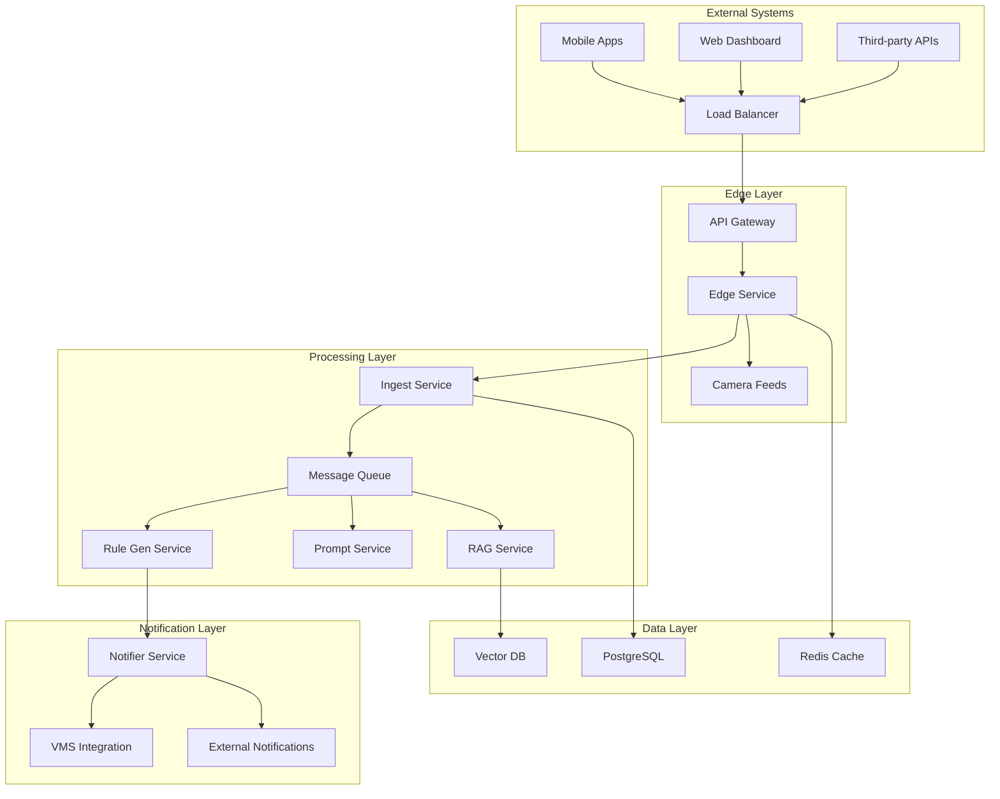

# 🔧 System Integration Documentation

## Overview

This documentation provides comprehensive guidance for integrating the AI-powered surveillance system with external services, third-party APIs, and enterprise infrastructure.

## 🏗️ Architecture Integration

### System Architecture Overview



### Integration Points

#### 1. API Gateway Integration
```yaml
# Kong API Gateway Configuration
_format_version: "3.0"
_transform: true

services:
  - name: surveillance-edge
    url: http://edge_service:8001
    plugins:
    - name: rate-limiting
      config:
        minute: 1000
        hour: 10000
    - name: cors
      config:
        origins:
        - "https://dashboard.surveillance-ai.com"
        - "https://mobile.surveillance-ai.com"
    - name: jwt
      config:
        key_claim_name: iss
        secret_is_base64: false

routes:
  - name: surveillance-api
    service: surveillance-edge
    paths:
    - /api/v1
    methods:
    - GET
    - POST
    - PUT
    - DELETE
```

#### 2. Load Balancer Configuration
```nginx
# nginx.conf for load balancing
upstream surveillance_backend {
    least_conn;
    server edge_service_1:8001 weight=3 max_fails=3 fail_timeout=30s;
    server edge_service_2:8001 weight=3 max_fails=3 fail_timeout=30s;
    server edge_service_3:8001 weight=2 max_fails=3 fail_timeout=30s;
    
    # Health check
    keepalive 32;
}

server {
    listen 443 ssl http2;
    server_name api.surveillance-ai.com;
    
    # SSL Configuration
    ssl_certificate /etc/ssl/certs/surveillance.crt;
    ssl_certificate_key /etc/ssl/private/surveillance.key;
    ssl_protocols TLSv1.2 TLSv1.3;
    ssl_ciphers ECDHE-RSA-AES256-GCM-SHA512:DHE-RSA-AES256-GCM-SHA512;
    ssl_prefer_server_ciphers off;
    
    # Security Headers
    add_header X-Frame-Options DENY;
    add_header X-Content-Type-Options nosniff;
    add_header X-XSS-Protection "1; mode=block";
    add_header Strict-Transport-Security "max-age=31536000; includeSubDomains";
    add_header Content-Security-Policy "default-src 'self'; script-src 'self' 'unsafe-inline'; style-src 'self' 'unsafe-inline';";
    
    location / {
        proxy_pass http://surveillance_backend;
        proxy_set_header Host $host;
        proxy_set_header X-Real-IP $remote_addr;
        proxy_set_header X-Forwarded-For $proxy_add_x_forwarded_for;
        proxy_set_header X-Forwarded-Proto $scheme;
        
        # Timeouts
        proxy_connect_timeout 5s;
        proxy_send_timeout 60s;
        proxy_read_timeout 60s;
        
        # Buffer settings
        proxy_buffering on;
        proxy_buffer_size 8k;
        proxy_buffers 16 8k;
        proxy_busy_buffers_size 16k;
    }
    
    # WebSocket proxy for real-time features
    location /ws {
        proxy_pass http://surveillance_backend;
        proxy_http_version 1.1;
        proxy_set_header Upgrade $http_upgrade;
        proxy_set_header Connection "upgrade";
        proxy_set_header Host $host;
        proxy_cache_bypass $http_upgrade;
        proxy_read_timeout 86400;
    }
    
    # Health check endpoint
    location /health {
        access_log off;
        proxy_pass http://surveillance_backend/health;
        proxy_connect_timeout 2s;
        proxy_read_timeout 2s;
    }
}
```

## 🔌 Third-Party API Integrations

### 1. Video Management System (VMS) Integration

#### Generic VMS Adapter
```python
# vms_adapter.py
from abc import ABC, abstractmethod
from typing import Dict, List, Optional
import requests
import aiohttp
import logging

logger = logging.getLogger(__name__)

class VMSAdapter(ABC):
    """Abstract base class for VMS integrations."""
    
    def __init__(self, config: Dict):
        self.config = config
        self.base_url = config.get('base_url')
        self.username = config.get('username')
        self.password = config.get('password')
        self.api_key = config.get('api_key')
        
    @abstractmethod
    async def authenticate(self) -> str:
        """Authenticate and return token."""
        pass
    
    @abstractmethod
    async def get_cameras(self) -> List[Dict]:
        """Get list of available cameras."""
        pass
    
    @abstractmethod
    async def get_stream_url(self, camera_id: str) -> str:
        """Get streaming URL for camera."""
        pass
    
    @abstractmethod
    async def trigger_recording(self, camera_id: str, duration: int) -> bool:
        """Trigger manual recording."""
        pass

class MilestoneVMSAdapter(VMSAdapter):
    """Milestone XProtect VMS integration."""
    
    async def authenticate(self) -> str:
        """Authenticate with Milestone API."""
        auth_url = f"{self.base_url}/IDP/connect/token"
        
        data = {
            'grant_type': 'password',
            'username': self.username,
            'password': self.password,
            'client_id': 'urn:milestone:integration'
        }
        
        async with aiohttp.ClientSession() as session:
            async with session.post(auth_url, data=data) as response:
                if response.status == 200:
                    result = await response.json()
                    return result['access_token']
                else:
                    raise Exception(f"Authentication failed: {response.status}")
    
    async def get_cameras(self) -> List[Dict]:
        """Get cameras from Milestone."""
        token = await self.authenticate()
        headers = {'Authorization': f'Bearer {token}'}
        
        cameras_url = f"{self.base_url}/api/rest/v1/cameras"
        
        async with aiohttp.ClientSession() as session:
            async with session.get(cameras_url, headers=headers) as response:
                if response.status == 200:
                    data = await response.json()
                    return [
                        {
                            'id': camera['id'],
                            'name': camera['displayName'],
                            'enabled': camera['enabled'],
                            'stream_url': f"{self.base_url}/api/rest/v1/cameras/{camera['id']}/live"
                        }
                        for camera in data.get('cameras', [])
                    ]
                else:
                    logger.error(f"Failed to get cameras: {response.status}")
                    return []

class HikvisionVMSAdapter(VMSAdapter):
    """Hikvision iVMS integration."""
    
    async def authenticate(self) -> str:
        """Authenticate with Hikvision API."""
        # Hikvision uses digest authentication
        return f"{self.username}:{self.password}"
    
    async def get_cameras(self) -> List[Dict]:
        """Get cameras from Hikvision."""
        auth = await self.authenticate()
        cameras_url = f"{self.base_url}/ISAPI/ContentMgmt/InputProxy/channels"
        
        async with aiohttp.ClientSession() as session:
            auth_obj = aiohttp.BasicAuth(self.username, self.password)
            async with session.get(cameras_url, auth=auth_obj) as response:
                if response.status == 200:
                    # Parse XML response (Hikvision uses XML)
                    import xml.etree.ElementTree as ET
                    xml_data = await response.text()
                    root = ET.fromstring(xml_data)
                    
                    cameras = []
                    for channel in root.findall('.//InputProxyChannel'):
                        cameras.append({
                            'id': channel.find('id').text,
                            'name': channel.find('name').text,
                            'enabled': channel.find('enabled').text == 'true',
                            'stream_url': f"{self.base_url}/ISAPI/Streaming/channels/{channel.find('id').text}01/httppreview"
                        })
                    
                    return cameras
                else:
                    logger.error(f"Failed to get cameras: {response.status}")
                    return []

# VMS Factory
class VMSFactory:
    """Factory for creating VMS adapters."""
    
    @staticmethod
    def create_adapter(vms_type: str, config: Dict) -> VMSAdapter:
        adapters = {
            'milestone': MilestoneVMSAdapter,
            'hikvision': HikvisionVMSAdapter,
            'axis': AxisVMSAdapter,
            'dahua': DahuaVMSAdapter,
        }
        
        adapter_class = adapters.get(vms_type.lower())
        if not adapter_class:
            raise ValueError(f"Unsupported VMS type: {vms_type}")
        
        return adapter_class(config)
```

#### VMS Integration Service
```python
# vms_integration_service.py
import asyncio
from typing import Dict, List
from .vms_adapter import VMSFactory
import logging

logger = logging.getLogger(__name__)

class VMSIntegrationService:
    """Service for integrating with Video Management Systems."""
    
    def __init__(self, config: Dict):
        self.config = config
        self.adapters = {}
        self._initialize_adapters()
    
    def _initialize_adapters(self):
        """Initialize VMS adapters from configuration."""
        vms_configs = self.config.get('vms_systems', {})
        
        for vms_name, vms_config in vms_configs.items():
            try:
                adapter = VMSFactory.create_adapter(
                    vms_config['type'], 
                    vms_config
                )
                self.adapters[vms_name] = adapter
                logger.info(f"Initialized VMS adapter: {vms_name}")
            except Exception as e:
                logger.error(f"Failed to initialize VMS {vms_name}: {e}")
    
    async def sync_cameras(self) -> Dict[str, List[Dict]]:
        """Sync cameras from all VMS systems."""
        all_cameras = {}
        
        for vms_name, adapter in self.adapters.items():
            try:
                cameras = await adapter.get_cameras()
                all_cameras[vms_name] = cameras
                logger.info(f"Synced {len(cameras)} cameras from {vms_name}")
            except Exception as e:
                logger.error(f"Failed to sync cameras from {vms_name}: {e}")
                all_cameras[vms_name] = []
        
        return all_cameras
    
    async def get_stream_url(self, vms_name: str, camera_id: str) -> Optional[str]:
        """Get stream URL for specific camera."""
        adapter = self.adapters.get(vms_name)
        if not adapter:
            logger.error(f"VMS adapter not found: {vms_name}")
            return None
        
        try:
            return await adapter.get_stream_url(camera_id)
        except Exception as e:
            logger.error(f"Failed to get stream URL: {e}")
            return None
    
    async def trigger_recording(self, vms_name: str, camera_id: str, duration: int = 60) -> bool:
        """Trigger manual recording on VMS."""
        adapter = self.adapters.get(vms_name)
        if not adapter:
            logger.error(f"VMS adapter not found: {vms_name}")
            return False
        
        try:
            return await adapter.trigger_recording(camera_id, duration)
        except Exception as e:
            logger.error(f"Failed to trigger recording: {e}")
            return False
```

### 2. Cloud Service Integrations

#### AWS Integration
```python
# aws_integration.py
import boto3
import asyncio
from botocore.exceptions import ClientError
import logging

logger = logging.getLogger(__name__)

class AWSIntegration:
    """AWS services integration."""
    
    def __init__(self, config: Dict):
        self.config = config
        self.s3_client = boto3.client(
            's3',
            aws_access_key_id=config.get('aws_access_key_id'),
            aws_secret_access_key=config.get('aws_secret_access_key'),
            region_name=config.get('aws_region', 'us-east-1')
        )
        self.sns_client = boto3.client('sns', region_name=config.get('aws_region'))
        self.rekognition_client = boto3.client('rekognition', region_name=config.get('aws_region'))
    
    async def upload_to_s3(self, file_path: str, bucket: str, key: str) -> str:
        """Upload file to S3."""
        try:
            self.s3_client.upload_file(file_path, bucket, key)
            url = f"https://{bucket}.s3.amazonaws.com/{key}"
            logger.info(f"Uploaded to S3: {url}")
            return url
        except ClientError as e:
            logger.error(f"S3 upload failed: {e}")
            raise
    
    async def send_sns_notification(self, topic_arn: str, message: str, subject: str = None) -> str:
        """Send SNS notification."""
        try:
            response = self.sns_client.publish(
                TopicArn=topic_arn,
                Message=message,
                Subject=subject
            )
            logger.info(f"SNS notification sent: {response['MessageId']}")
            return response['MessageId']
        except ClientError as e:
            logger.error(f"SNS notification failed: {e}")
            raise
    
    async def analyze_image_rekognition(self, image_bytes: bytes) -> Dict:
        """Analyze image using AWS Rekognition."""
        try:
            response = self.rekognition_client.detect_labels(
                Image={'Bytes': image_bytes},
                MaxLabels=10,
                MinConfidence=80
            )
            
            labels = [
                {
                    'name': label['Name'],
                    'confidence': label['Confidence'],
                    'categories': [cat['Name'] for cat in label.get('Categories', [])]
                }
                for label in response['Labels']
            ]
            
            return {'labels': labels}
        except ClientError as e:
            logger.error(f"Rekognition analysis failed: {e}")
            raise

# Microsoft Azure Integration
class AzureIntegration:
    """Microsoft Azure services integration."""
    
    def __init__(self, config: Dict):
        self.config = config
        from azure.storage.blob import BlobServiceClient
        from azure.cognitiveservices.vision.computervision import ComputerVisionClient
        from msrest.authentication import CognitiveServicesCredentials
        
        # Blob Storage
        self.blob_service = BlobServiceClient(
            account_url=f"https://{config['storage_account']}.blob.core.windows.net",
            credential=config['storage_key']
        )
        
        # Computer Vision
        self.cv_client = ComputerVisionClient(
            config['cv_endpoint'],
            CognitiveServicesCredentials(config['cv_key'])
        )
    
    async def upload_to_blob(self, data: bytes, container: str, blob_name: str) -> str:
        """Upload data to Azure Blob Storage."""
        try:
            blob_client = self.blob_service.get_blob_client(
                container=container, 
                blob=blob_name
            )
            blob_client.upload_blob(data, overwrite=True)
            
            url = f"https://{self.config['storage_account']}.blob.core.windows.net/{container}/{blob_name}"
            logger.info(f"Uploaded to Azure Blob: {url}")
            return url
        except Exception as e:
            logger.error(f"Azure Blob upload failed: {e}")
            raise
    
    async def analyze_image_cv(self, image_url: str) -> Dict:
        """Analyze image using Azure Computer Vision."""
        try:
            # Analyze image
            analysis = self.cv_client.analyze_image(
                image_url,
                visual_features=['Objects', 'Tags', 'Description']
            )
            
            return {
                'objects': [
                    {
                        'name': obj.object_property,
                        'confidence': obj.confidence,
                        'rectangle': {
                            'x': obj.rectangle.x,
                            'y': obj.rectangle.y,
                            'w': obj.rectangle.w,
                            'h': obj.rectangle.h
                        }
                    }
                    for obj in analysis.objects
                ],
                'tags': [
                    {'name': tag.name, 'confidence': tag.confidence}
                    for tag in analysis.tags
                ],
                'description': analysis.description.captions[0].text if analysis.description.captions else ""
            }
        except Exception as e:
            logger.error(f"Azure CV analysis failed: {e}")
            raise
```

### 3. Enterprise Authentication Integration

#### LDAP/Active Directory Integration
```python
# ldap_integration.py
import ldap
import asyncio
from typing import Dict, Optional, List
import logging

logger = logging.getLogger(__name__)

class LDAPIntegration:
    """LDAP/Active Directory integration for authentication."""
    
    def __init__(self, config: Dict):
        self.config = config
        self.server_url = config['server_url']
        self.base_dn = config['base_dn']
        self.bind_dn = config.get('bind_dn')
        self.bind_password = config.get('bind_password')
        self.user_search_base = config.get('user_search_base', self.base_dn)
        self.group_search_base = config.get('group_search_base', self.base_dn)
    
    def _get_connection(self) -> ldap.ldapobject.LDAPObject:
        """Create LDAP connection."""
        conn = ldap.initialize(self.server_url)
        conn.set_option(ldap.OPT_REFERRALS, 0)
        conn.set_option(ldap.OPT_PROTOCOL_VERSION, 3)
        
        if self.bind_dn and self.bind_password:
            conn.simple_bind_s(self.bind_dn, self.bind_password)
        
        return conn
    
    async def authenticate_user(self, username: str, password: str) -> Optional[Dict]:
        """Authenticate user against LDAP."""
        try:
            # Search for user
            user_dn = await self.find_user_dn(username)
            if not user_dn:
                logger.warning(f"User not found: {username}")
                return None
            
            # Try to bind with user credentials
            conn = ldap.initialize(self.server_url)
            conn.set_option(ldap.OPT_REFERRALS, 0)
            conn.set_option(ldap.OPT_PROTOCOL_VERSION, 3)
            
            try:
                conn.simple_bind_s(user_dn, password)
                logger.info(f"LDAP authentication successful: {username}")
                
                # Get user details
                user_info = await self.get_user_info(username)
                return user_info
                
            except ldap.INVALID_CREDENTIALS:
                logger.warning(f"Invalid credentials for user: {username}")
                return None
            finally:
                conn.unbind()
                
        except Exception as e:
            logger.error(f"LDAP authentication error: {e}")
            return None
    
    async def find_user_dn(self, username: str) -> Optional[str]:
        """Find user DN by username."""
        try:
            conn = self._get_connection()
            
            search_filter = f"(sAMAccountName={username})"  # Active Directory
            # For OpenLDAP: search_filter = f"(uid={username})"
            
            result = conn.search_s(
                self.user_search_base,
                ldap.SCOPE_SUBTREE,
                search_filter,
                ['distinguishedName']
            )
            
            if result:
                return result[0][0]  # Return DN
            
            return None
            
        except Exception as e:
            logger.error(f"User DN search error: {e}")
            return None
        finally:
            conn.unbind()
    
    async def get_user_info(self, username: str) -> Optional[Dict]:
        """Get user information from LDAP."""
        try:
            conn = self._get_connection()
            
            search_filter = f"(sAMAccountName={username})"
            attributes = [
                'displayName', 'mail', 'department', 
                'title', 'telephoneNumber', 'memberOf'
            ]
            
            result = conn.search_s(
                self.user_search_base,
                ldap.SCOPE_SUBTREE,
                search_filter,
                attributes
            )
            
            if result:
                _, attrs = result[0]
                
                # Extract group memberships
                groups = []
                if 'memberOf' in attrs:
                    for group_dn in attrs['memberOf']:
                        group_name = group_dn.decode('utf-8').split(',')[0].split('=')[1]
                        groups.append(group_name)
                
                return {
                    'username': username,
                    'display_name': attrs.get('displayName', [b''])[0].decode('utf-8'),
                    'email': attrs.get('mail', [b''])[0].decode('utf-8'),
                    'department': attrs.get('department', [b''])[0].decode('utf-8'),
                    'title': attrs.get('title', [b''])[0].decode('utf-8'),
                    'phone': attrs.get('telephoneNumber', [b''])[0].decode('utf-8'),
                    'groups': groups
                }
            
            return None
            
        except Exception as e:
            logger.error(f"User info retrieval error: {e}")
            return None
        finally:
            conn.unbind()
    
    async def get_user_groups(self, username: str) -> List[str]:
        """Get user's group memberships."""
        user_info = await self.get_user_info(username)
        return user_info.get('groups', []) if user_info else []

# SAML Integration
class SAMLIntegration:
    """SAML SSO integration."""
    
    def __init__(self, config: Dict):
        from onelogin.saml2.auth import OneLogin_Saml2_Auth
        from onelogin.saml2.settings import OneLogin_Saml2_Settings
        
        self.config = config
        self.saml_settings = OneLogin_Saml2_Settings(config['saml_settings'])
    
    def initiate_sso(self, request) -> str:
        """Initiate SAML SSO."""
        from onelogin.saml2.auth import OneLogin_Saml2_Auth
        
        auth = OneLogin_Saml2_Auth(request, self.saml_settings.get_settings())
        return auth.login()
    
    def process_response(self, request) -> Optional[Dict]:
        """Process SAML response."""
        from onelogin.saml2.auth import OneLogin_Saml2_Auth
        
        auth = OneLogin_Saml2_Auth(request, self.saml_settings.get_settings())
        auth.process_response()
        
        if auth.is_authenticated():
            attributes = auth.get_attributes()
            return {
                'username': auth.get_nameid(),
                'email': attributes.get('http://schemas.xmlsoap.org/ws/2005/05/identity/claims/emailaddress', [''])[0],
                'display_name': attributes.get('http://schemas.xmlsoap.org/ws/2005/05/identity/claims/name', [''])[0],
                'groups': attributes.get('http://schemas.microsoft.com/ws/2008/06/identity/claims/groups', [])
            }
        
        return None
```

### 4. Message Queue Integration

#### Apache Kafka Integration
```python
# kafka_integration.py
from kafka import KafkaProducer, KafkaConsumer
from kafka.admin import KafkaAdminClient, NewTopic
import json
import asyncio
from typing import Dict, List, Callable
import logging

logger = logging.getLogger(__name__)

class KafkaIntegration:
    """Apache Kafka integration for message streaming."""
    
    def __init__(self, config: Dict):
        self.config = config
        self.bootstrap_servers = config['bootstrap_servers']
        self.producer = None
        self.consumers = {}
        self.admin_client = None
        
    async def initialize(self):
        """Initialize Kafka clients."""
        # Producer
        self.producer = KafkaProducer(
            bootstrap_servers=self.bootstrap_servers,
            value_serializer=lambda v: json.dumps(v).encode('utf-8'),
            key_serializer=lambda k: k.encode('utf-8') if k else None,
            retries=3,
            acks='all',
            compression_type='gzip'
        )
        
        # Admin client
        self.admin_client = KafkaAdminClient(
            bootstrap_servers=self.bootstrap_servers
        )
        
        # Create topics if they don't exist
        await self.create_topics()
        
        logger.info("Kafka integration initialized")
    
    async def create_topics(self):
        """Create required Kafka topics."""
        topics = [
            NewTopic(name="surveillance.events", num_partitions=3, replication_factor=1),
            NewTopic(name="surveillance.detections", num_partitions=3, replication_factor=1),
            NewTopic(name="surveillance.alerts", num_partitions=3, replication_factor=1),
            NewTopic(name="surveillance.logs", num_partitions=3, replication_factor=1),
        ]
        
        try:
            self.admin_client.create_topics(topics, validate_only=False)
            logger.info("Kafka topics created")
        except Exception as e:
            logger.warning(f"Topic creation warning: {e}")
    
    async def publish_event(self, topic: str, event: Dict, key: str = None):
        """Publish event to Kafka topic."""
        try:
            future = self.producer.send(topic, value=event, key=key)
            record_metadata = future.get(timeout=10)
            
            logger.debug(f"Event published to {topic}: partition {record_metadata.partition}, offset {record_metadata.offset}")
            
        except Exception as e:
            logger.error(f"Failed to publish event to {topic}: {e}")
            raise
    
    async def subscribe_to_topic(self, topic: str, callback: Callable, group_id: str = None):
        """Subscribe to Kafka topic with callback."""
        consumer = KafkaConsumer(
            topic,
            bootstrap_servers=self.bootstrap_servers,
            group_id=group_id or f"surveillance-{topic}",
            value_deserializer=lambda m: json.loads(m.decode('utf-8')),
            auto_offset_reset='latest',
            enable_auto_commit=True
        )
        
        self.consumers[topic] = consumer
        
        # Start consuming in background
        asyncio.create_task(self._consume_messages(consumer, callback))
        
        logger.info(f"Subscribed to topic: {topic}")
    
    async def _consume_messages(self, consumer: KafkaConsumer, callback: Callable):
        """Consume messages from Kafka topic."""
        try:
            for message in consumer:
                try:
                    await callback(message.value)
                except Exception as e:
                    logger.error(f"Error processing message: {e}")
        except Exception as e:
            logger.error(f"Consumer error: {e}")
    
    async def close(self):
        """Close Kafka connections."""
        if self.producer:
            self.producer.close()
        
        for consumer in self.consumers.values():
            consumer.close()
        
        if self.admin_client:
            self.admin_client.close()
        
        logger.info("Kafka integration closed")

# RabbitMQ Integration
class RabbitMQIntegration:
    """RabbitMQ integration for message queuing."""
    
    def __init__(self, config: Dict):
        import aio_pika
        self.config = config
        self.connection = None
        self.channel = None
        self.exchanges = {}
        self.queues = {}
    
    async def connect(self):
        """Connect to RabbitMQ."""
        import aio_pika
        
        connection_url = (
            f"amqp://{self.config['username']}:{self.config['password']}"
            f"@{self.config['host']}:{self.config.get('port', 5672)}/"
        )
        
        self.connection = await aio_pika.connect_robust(connection_url)
        self.channel = await self.connection.channel()
        
        # Set up exchanges
        await self.setup_exchanges()
        
        logger.info("RabbitMQ connection established")
    
    async def setup_exchanges(self):
        """Set up RabbitMQ exchanges."""
        import aio_pika
        
        exchanges_config = {
            'surveillance.events': 'topic',
            'surveillance.alerts': 'direct',
            'surveillance.logs': 'fanout'
        }
        
        for exchange_name, exchange_type in exchanges_config.items():
            exchange = await self.channel.declare_exchange(
                exchange_name,
                getattr(aio_pika.ExchangeType, exchange_type.upper()),
                durable=True
            )
            self.exchanges[exchange_name] = exchange
            
        logger.info("RabbitMQ exchanges configured")
    
    async def publish_message(self, exchange_name: str, routing_key: str, message: Dict):
        """Publish message to RabbitMQ."""
        import aio_pika
        
        exchange = self.exchanges.get(exchange_name)
        if not exchange:
            raise ValueError(f"Exchange not found: {exchange_name}")
        
        message_body = aio_pika.Message(
            json.dumps(message).encode(),
            content_type="application/json",
            delivery_mode=aio_pika.DeliveryMode.PERSISTENT
        )
        
        await exchange.publish(message_body, routing_key=routing_key)
        logger.debug(f"Message published to {exchange_name} with routing key {routing_key}")
    
    async def consume_messages(self, queue_name: str, callback: Callable):
        """Consume messages from RabbitMQ queue."""
        import aio_pika
        
        queue = await self.channel.declare_queue(queue_name, durable=True)
        
        async def process_message(message: aio_pika.IncomingMessage):
            async with message.process():
                try:
                    data = json.loads(message.body.decode())
                    await callback(data)
                except Exception as e:
                    logger.error(f"Error processing message: {e}")
                    raise
        
        await queue.consume(process_message)
        logger.info(f"Started consuming from queue: {queue_name}")
```

## 🔄 Data Synchronization

### Real-time Data Sync
```python
# data_sync.py
import asyncio
from typing import Dict, List, Callable
from datetime import datetime, timedelta
import logging

logger = logging.getLogger(__name__)

class DataSyncManager:
    """Manages data synchronization between systems."""
    
    def __init__(self, config: Dict):
        self.config = config
        self.sync_tasks = {}
        self.sync_callbacks = {}
        
    async def register_sync_source(self, source_name: str, callback: Callable, interval: int = 60):
        """Register a data source for synchronization."""
        self.sync_callbacks[source_name] = {
            'callback': callback,
            'interval': interval,
            'last_sync': None
        }
        
        # Start sync task
        task = asyncio.create_task(self._sync_loop(source_name))
        self.sync_tasks[source_name] = task
        
        logger.info(f"Registered sync source: {source_name} (interval: {interval}s)")
    
    async def _sync_loop(self, source_name: str):
        """Sync loop for a data source."""
        while True:
            try:
                sync_info = self.sync_callbacks[source_name]
                
                # Execute sync callback
                start_time = datetime.now()
                result = await sync_info['callback']()
                end_time = datetime.now()
                
                sync_info['last_sync'] = end_time
                
                logger.info(f"Sync completed for {source_name}: {end_time - start_time}")
                
                # Wait for next interval
                await asyncio.sleep(sync_info['interval'])
                
            except Exception as e:
                logger.error(f"Sync error for {source_name}: {e}")
                await asyncio.sleep(60)  # Wait before retry
    
    async def trigger_sync(self, source_name: str):
        """Manually trigger sync for a source."""
        if source_name in self.sync_callbacks:
            callback = self.sync_callbacks[source_name]['callback']
            await callback()
            logger.info(f"Manual sync triggered for {source_name}")
        else:
            logger.warning(f"Sync source not found: {source_name}")
    
    async def get_sync_status(self) -> Dict:
        """Get synchronization status for all sources."""
        status = {}
        
        for source_name, sync_info in self.sync_callbacks.items():
            last_sync = sync_info['last_sync']
            next_sync = None
            
            if last_sync:
                next_sync = last_sync + timedelta(seconds=sync_info['interval'])
            
            status[source_name] = {
                'last_sync': last_sync.isoformat() if last_sync else None,
                'next_sync': next_sync.isoformat() if next_sync else None,
                'interval': sync_info['interval'],
                'status': 'running' if source_name in self.sync_tasks else 'stopped'
            }
        
        return status
    
    async def stop_sync(self, source_name: str):
        """Stop synchronization for a source."""
        if source_name in self.sync_tasks:
            self.sync_tasks[source_name].cancel()
            del self.sync_tasks[source_name]
            logger.info(f"Stopped sync for {source_name}")
    
    async def stop_all_sync(self):
        """Stop all synchronization tasks."""
        for task in self.sync_tasks.values():
            task.cancel()
        
        self.sync_tasks.clear()
        logger.info("All sync tasks stopped")
```

## 📊 API Documentation & Testing

### OpenAPI Specification
```yaml
# openapi.yaml
openapi: 3.0.3
info:
  title: Surveillance System API
  version: 1.0.0
  description: AI-powered surveillance system REST API
  contact:
    name: Support Team
    email: support@surveillance-ai.com
    url: https://surveillance-ai.com/support

servers:
  - url: https://api.surveillance-ai.com/v1
    description: Production server
  - url: https://staging-api.surveillance-ai.com/v1
    description: Staging server
  - url: http://localhost:8001
    description: Development server

security:
  - bearerAuth: []

paths:
  /health:
    get:
      summary: Health check
      tags:
        - System
      security: []
      responses:
        '200':
          description: System is healthy
          content:
            application/json:
              schema:
                $ref: '#/components/schemas/HealthStatus'

  /auth/login:
    post:
      summary: User authentication
      tags:
        - Authentication
      security: []
      requestBody:
        required: true
        content:
          application/json:
            schema:
              $ref: '#/components/schemas/LoginRequest'
      responses:
        '200':
          description: Authentication successful
          content:
            application/json:
              schema:
                $ref: '#/components/schemas/LoginResponse'
        '401':
          description: Authentication failed

  /cameras:
    get:
      summary: List cameras
      tags:
        - Cameras
      parameters:
        - name: status
          in: query
          schema:
            type: string
            enum: [active, inactive, all]
          description: Filter by camera status
      responses:
        '200':
          description: List of cameras
          content:
            application/json:
              schema:
                type: array
                items:
                  $ref: '#/components/schemas/Camera'

  /detections:
    get:
      summary: List detections
      tags:
        - Detections
      parameters:
        - name: camera_id
          in: query
          schema:
            type: string
        - name: start_time
          in: query
          schema:
            type: string
            format: date-time
        - name: end_time
          in: query
          schema:
            type: string
            format: date-time
        - name: confidence_min
          in: query
          schema:
            type: number
            minimum: 0
            maximum: 1
      responses:
        '200':
          description: List of detections
          content:
            application/json:
              schema:
                $ref: '#/components/schemas/DetectionList'

components:
  securitySchemes:
    bearerAuth:
      type: http
      scheme: bearer
      bearerFormat: JWT

  schemas:
    HealthStatus:
      type: object
      properties:
        status:
          type: string
          enum: [healthy, degraded, unhealthy]
        timestamp:
          type: string
          format: date-time
        services:
          type: object
          additionalProperties:
            type: object
            properties:
              status:
                type: string
              response_time:
                type: number

    LoginRequest:
      type: object
      required:
        - username
        - password
      properties:
        username:
          type: string
          minLength: 3
          maxLength: 50
        password:
          type: string
          minLength: 8

    LoginResponse:
      type: object
      properties:
        access_token:
          type: string
        refresh_token:
          type: string
        expires_in:
          type: integer
        user:
          $ref: '#/components/schemas/User'

    User:
      type: object
      properties:
        id:
          type: string
        username:
          type: string
        email:
          type: string
          format: email
        roles:
          type: array
          items:
            type: string

    Camera:
      type: object
      properties:
        id:
          type: string
        name:
          type: string
        location:
          type: string
        status:
          type: string
          enum: [active, inactive, error]
        stream_url:
          type: string
          format: uri
        last_seen:
          type: string
          format: date-time

    Detection:
      type: object
      properties:
        id:
          type: string
        camera_id:
          type: string
        timestamp:
          type: string
          format: date-time
        type:
          type: string
        confidence:
          type: number
          minimum: 0
          maximum: 1
        bounding_box:
          type: object
          properties:
            x:
              type: integer
            y:
              type: integer
            width:
              type: integer
            height:
              type: integer

    DetectionList:
      type: object
      properties:
        detections:
          type: array
          items:
            $ref: '#/components/schemas/Detection'
        total:
          type: integer
        page:
          type: integer
        page_size:
          type: integer
```

### Integration Testing Framework
```python
# integration_tests.py
import pytest
import asyncio
import aiohttp
from typing import Dict
import json

class SurveillanceAPIClient:
    """Test client for surveillance API."""
    
    def __init__(self, base_url: str):
        self.base_url = base_url
        self.session = None
        self.auth_token = None
    
    async def __aenter__(self):
        self.session = aiohttp.ClientSession()
        return self
    
    async def __aexit__(self, exc_type, exc_val, exc_tb):
        if self.session:
            await self.session.close()
    
    async def login(self, username: str, password: str) -> Dict:
        """Authenticate and get token."""
        url = f"{self.base_url}/auth/login"
        data = {"username": username, "password": password}
        
        async with self.session.post(url, json=data) as response:
            result = await response.json()
            
            if response.status == 200:
                self.auth_token = result['access_token']
            
            return result
    
    async def get_cameras(self) -> Dict:
        """Get list of cameras."""
        url = f"{self.base_url}/cameras"
        headers = {"Authorization": f"Bearer {self.auth_token}"}
        
        async with self.session.get(url, headers=headers) as response:
            return await response.json()
    
    async def get_detections(self, **params) -> Dict:
        """Get detections with optional filters."""
        url = f"{self.base_url}/detections"
        headers = {"Authorization": f"Bearer {self.auth_token}"}
        
        async with self.session.get(url, headers=headers, params=params) as response:
            return await response.json()
    
    async def health_check(self) -> Dict:
        """Check system health."""
        url = f"{self.base_url}/health"
        
        async with self.session.get(url) as response:
            return await response.json()

@pytest.fixture
async def api_client():
    """API client fixture."""
    async with SurveillanceAPIClient("http://localhost:8001") as client:
        yield client

@pytest.mark.asyncio
async def test_health_check(api_client):
    """Test health check endpoint."""
    health = await api_client.health_check()
    
    assert 'status' in health
    assert health['status'] in ['healthy', 'degraded', 'unhealthy']
    assert 'timestamp' in health
    assert 'services' in health

@pytest.mark.asyncio
async def test_authentication_flow(api_client):
    """Test authentication flow."""
    # Test login
    result = await api_client.login("admin", "admin123")
    
    assert 'access_token' in result
    assert 'refresh_token' in result
    assert 'expires_in' in result
    assert api_client.auth_token is not None

@pytest.mark.asyncio
async def test_cameras_endpoint(api_client):
    """Test cameras endpoint."""
    # Login first
    await api_client.login("admin", "admin123")
    
    # Get cameras
    cameras = await api_client.get_cameras()
    
    assert isinstance(cameras, list)
    
    if cameras:
        camera = cameras[0]
        assert 'id' in camera
        assert 'name' in camera
        assert 'status' in camera

@pytest.mark.asyncio
async def test_detections_endpoint(api_client):
    """Test detections endpoint."""
    # Login first
    await api_client.login("admin", "admin123")
    
    # Get detections
    detections = await api_client.get_detections()
    
    assert 'detections' in detections
    assert 'total' in detections
    assert isinstance(detections['detections'], list)

@pytest.mark.asyncio
async def test_integration_workflow(api_client):
    """Test complete integration workflow."""
    # 1. Health check
    health = await api_client.health_check()
    assert health['status'] == 'healthy'
    
    # 2. Authentication
    auth_result = await api_client.login("admin", "admin123")
    assert 'access_token' in auth_result
    
    # 3. Get cameras
    cameras = await api_client.get_cameras()
    assert isinstance(cameras, list)
    
    # 4. Get detections
    detections = await api_client.get_detections()
    assert 'detections' in detections
    
    # 5. Filtered detections
    if cameras:
        camera_id = cameras[0]['id']
        filtered_detections = await api_client.get_detections(camera_id=camera_id)
        assert 'detections' in filtered_detections

# Performance tests
@pytest.mark.asyncio
async def test_api_performance(api_client):
    """Test API performance."""
    import time
    
    # Login
    await api_client.login("admin", "admin123")
    
    # Test response times
    start_time = time.time()
    await api_client.health_check()
    health_time = time.time() - start_time
    
    start_time = time.time()
    await api_client.get_cameras()
    cameras_time = time.time() - start_time
    
    start_time = time.time()
    await api_client.get_detections()
    detections_time = time.time() - start_time
    
    # Assert reasonable response times
    assert health_time < 1.0  # Health check should be fast
    assert cameras_time < 2.0  # Cameras endpoint
    assert detections_time < 5.0  # Detections might be slower
```

## 🔧 Configuration Management

### Environment Configuration
```yaml
# config/production.yaml
environment: production

database:
  postgresql:
    host: postgres-cluster.internal
    port: 5432
    database: surveillance_prod
    username: surveillance_user
    password: ${DATABASE_PASSWORD}
    pool_size: 20
    max_overflow: 50
    
  redis:
    host: redis-cluster.internal
    port: 6379
    password: ${REDIS_PASSWORD}
    db: 0
    max_connections: 100

vector_database:
  weaviate:
    host: weaviate-cluster.internal
    port: 8080
    scheme: http
    
message_queue:
  type: kafka
  kafka:
    bootstrap_servers:
      - kafka-1.internal:9092
      - kafka-2.internal:9092
      - kafka-3.internal:9092
    security_protocol: SASL_SSL
    sasl_mechanism: PLAIN
    sasl_username: surveillance
    sasl_password: ${KAFKA_PASSWORD}

external_apis:
  openai:
    api_key: ${OPENAI_API_KEY}
    model: gpt-4
    max_tokens: 4000
    temperature: 0.7

vms_systems:
  milestone:
    type: milestone
    base_url: https://milestone.company.com
    username: surveillance_api
    password: ${MILESTONE_PASSWORD}
    
  hikvision:
    type: hikvision
    base_url: https://hikvision.company.com
    username: admin
    password: ${HIKVISION_PASSWORD}

cloud_services:
  aws:
    aws_access_key_id: ${AWS_ACCESS_KEY_ID}
    aws_secret_access_key: ${AWS_SECRET_ACCESS_KEY}
    aws_region: us-east-1
    s3_bucket: surveillance-media-prod
    sns_topic_arn: arn:aws:sns:us-east-1:123456789:surveillance-alerts
    
  azure:
    storage_account: surveillancestorage
    storage_key: ${AZURE_STORAGE_KEY}
    cv_endpoint: https://eastus.api.cognitive.microsoft.com/
    cv_key: ${AZURE_CV_KEY}

authentication:
  jwt:
    secret: ${JWT_SECRET}
    algorithm: HS256
    access_token_expire_minutes: 15
    refresh_token_expire_days: 7
    
  ldap:
    server_url: ldap://dc.company.com:389
    base_dn: dc=company,dc=com
    bind_dn: cn=surveillance,ou=service-accounts,dc=company,dc=com
    bind_password: ${LDAP_PASSWORD}
    user_search_base: ou=users,dc=company,dc=com
    group_search_base: ou=groups,dc=company,dc=com

monitoring:
  prometheus:
    push_gateway: http://prometheus-pushgateway:9091
    job_name: surveillance-system
    
  grafana:
    url: http://grafana:3000
    username: admin
    password: ${GRAFANA_PASSWORD}
    
  elasticsearch:
    hosts:
      - elasticsearch-1.internal:9200
      - elasticsearch-2.internal:9200
    username: surveillance
    password: ${ELASTICSEARCH_PASSWORD}

security:
  encryption:
    key: ${ENCRYPTION_KEY}
    algorithm: AES-256-GCM
    
  ssl:
    cert_file: /etc/ssl/certs/surveillance.crt
    key_file: /etc/ssl/private/surveillance.key
    
  rate_limiting:
    requests_per_minute: 1000
    requests_per_hour: 10000
    burst_size: 100

notification_channels:
  email:
    smtp_server: smtp.company.com
    smtp_port: 587
    username: surveillance@company.com
    password: ${EMAIL_PASSWORD}
    use_tls: true
    
  slack:
    webhook_url: ${SLACK_WEBHOOK_URL}
    channel: "#surveillance-alerts"
    
  sms:
    provider: twilio
    account_sid: ${TWILIO_ACCOUNT_SID}
    auth_token: ${TWILIO_AUTH_TOKEN}
    from_number: "+1234567890"

logging:
  level: INFO
  format: json
  output: elasticsearch
  retention_days: 90
```

---

## 🚀 Quick Start Integration Guide

### 1. Choose Integration Points
- Identify which external systems to integrate
- Determine authentication requirements
- Plan data flow and synchronization

### 2. Configure Environment
- Update configuration files with integration settings
- Set up authentication credentials
- Configure network access and security

### 3. Test Integration
- Use provided test frameworks
- Verify data synchronization
- Test error handling and failover

### 4. Deploy & Monitor
- Deploy with monitoring enabled
- Set up alerts for integration failures
- Monitor performance and data consistency

For specific integration requirements or custom adapters, refer to the individual service documentation or contact the development team.
