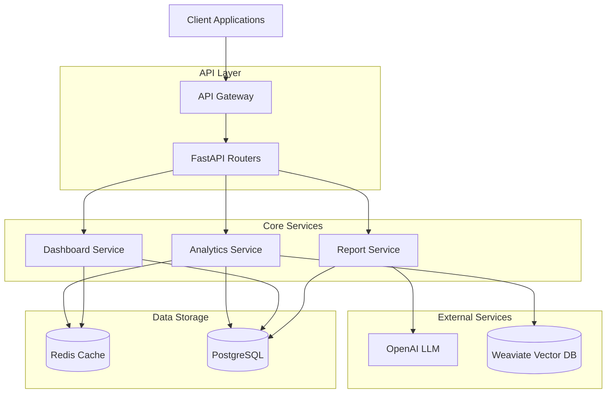
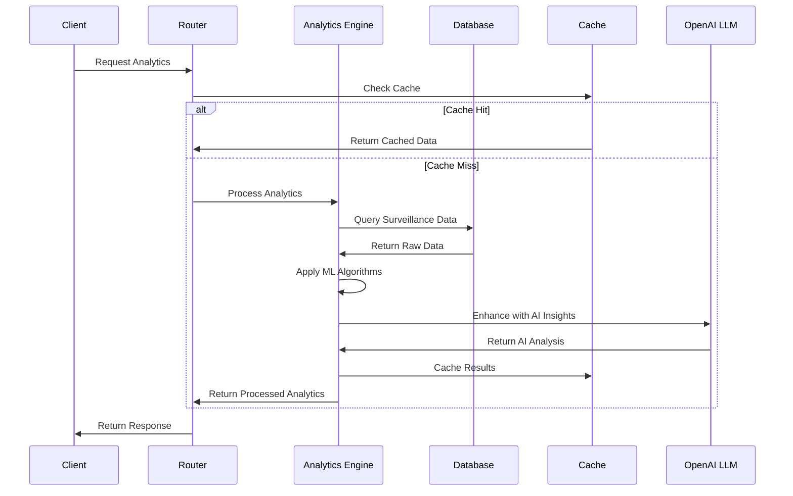
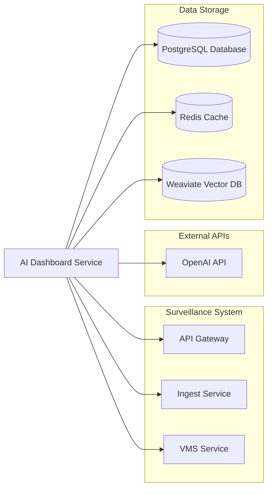
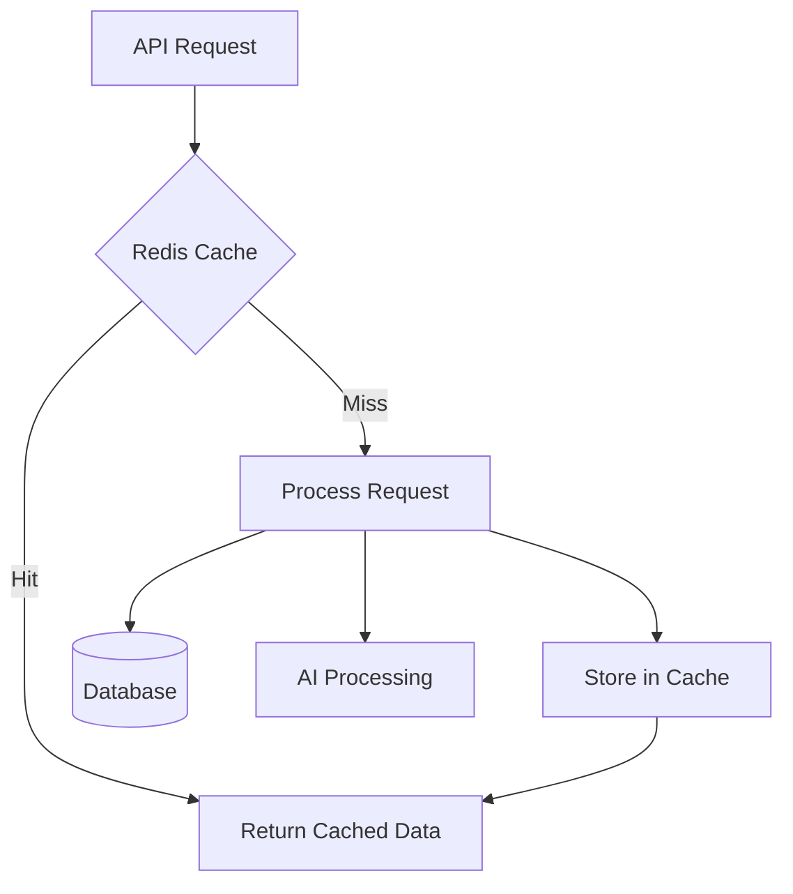
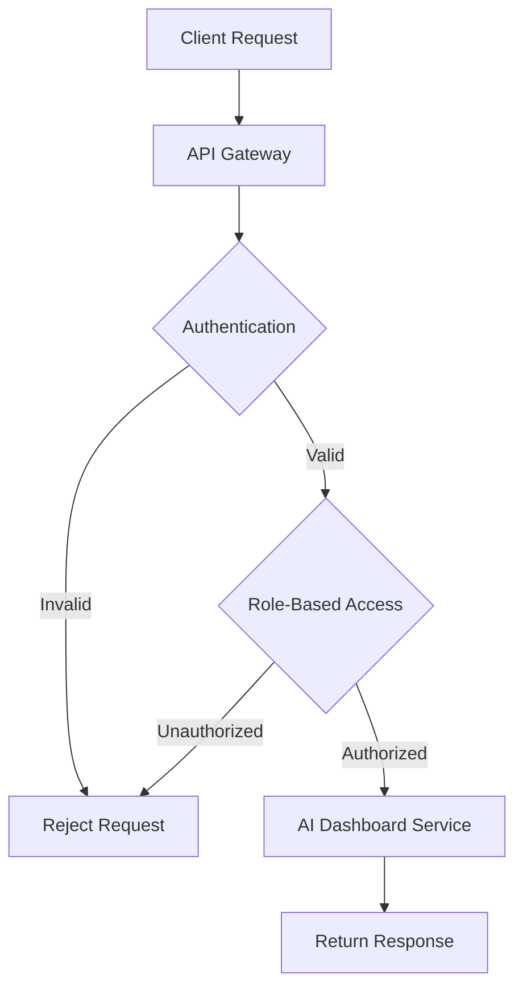
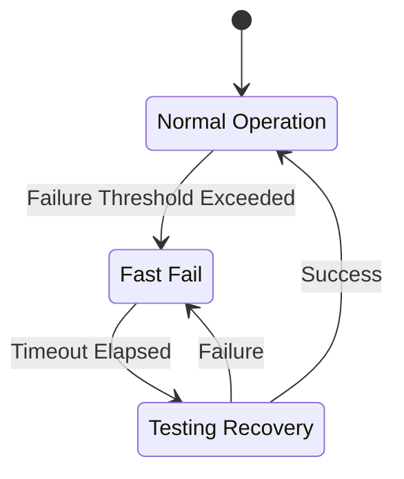
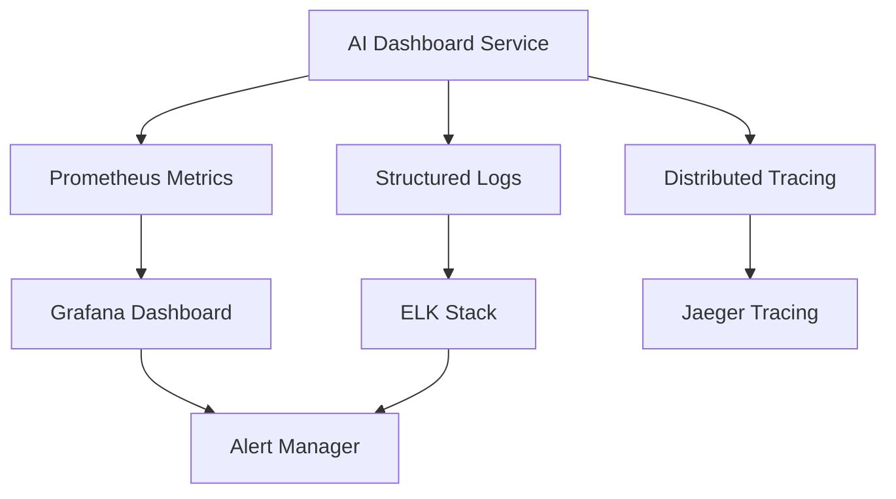

# AI Dashboard Service Architecture

## Overview

The AI Dashboard Service is designed as a modular, scalable microservice that provides advanced analytics and predictive insights for surveillance systems. It serves as the intelligence layer, processing surveillance data through machine learning algorithms and providing actionable insights via AI-powered analysis.

## System Architecture



## Data Flow Architecture



### Package Structure

The service follows a clean architecture pattern with clear separation of concerns:

```
ai_dashboard_service/
├── app/                    # Main application package
│   ├── __init__.py
│   ├── main.py            # FastAPI application entry point
│   ├── models/            # Data models and schemas
│   │   ├── __init__.py
│   │   ├── enums.py       # Enumeration types
│   │   └── schemas.py     # Pydantic request/response models
│   ├── services/          # Business logic layer
│   │   ├── __init__.py
│   │   ├── analytics.py   # Analytics processing engine
│   │   ├── dashboard.py   # Dashboard data management
│   │   ├── llm_client.py  # OpenAI integration client
│   │   ├── predictive.py  # Predictive analytics engine
│   │   └── reports.py     # Report generation engine
│   ├── routers/           # FastAPI route handlers
│   │   ├── __init__.py
│   │   └── dashboard.py   # API endpoint definitions
│   └── utils/             # Shared utilities and helpers
│       ├── __init__.py
│       ├── database.py    # Database connection management
│       ├── dependencies.py # Dependency injection
│       └── helpers.py     # Utility functions
├── config/                # Configuration management
│   ├── __init__.py
│   └── config.py          # Centralized settings
├── tests/                 # Comprehensive test suite
├── docs/                  # Documentation
└── requirements.txt       # Python dependencies
```

**Architecture Principles:**
- **Separation of Concerns**: Each layer has a specific responsibility
- **Dependency Injection**: Services are injected for testability
- **Configuration Management**: Centralized environment-based config
- **Error Handling**: Consistent error responses across all endpoints
- **Caching Strategy**: Redis-based caching for performance optimization

### Core Components

#### Analytics Engine (`app/services/analytics.py`)
- **Trend Analysis**: Statistical methods for identifying patterns over time
- **Anomaly Detection**: Machine learning algorithms with configurable thresholds
- **Pattern Recognition**: Advanced algorithms for behavioral pattern analysis
- **Performance Optimization**: Redis caching for frequently accessed analytics
- **Data Processing**: Handles various surveillance data formats and sources

**Key Features:**
- Real-time anomaly detection with configurable sensitivity
- Trend analysis using moving averages and statistical correlation
- Pattern recognition for recurring events and behaviors
- Caching layer for performance optimization

#### Dashboard Service (`app/services/dashboard.py`)
- **Widget Management**: Dynamic dashboard component creation and configuration
- **Real-time Data**: Live surveillance data aggregation and presentation
- **User Personalization**: Customizable dashboards per user/role
- **Data Integration**: Seamless integration with analytics and predictive services

**Widget Types:**
- Analytics charts and visualizations
- Alert summaries and notifications
- KPI metrics and performance indicators
- Trend visualizations and heatmaps

#### Predictive Engine (`app/services/predictive.py`)
- **Security Threat Prediction**: ML models for threat assessment
- **Equipment Failure Forecasting**: Predictive maintenance algorithms
- **Traffic Pattern Analysis**: Behavioral prediction for crowd management
- **Occupancy Level Predictions**: Space utilization forecasting

**Model Types:**
- Time series forecasting models
- Classification models for threat detection
- Regression models for equipment health
- Clustering algorithms for pattern analysis

#### Report Generator (`app/services/reports.py`)
- **AI-Powered Summarization**: Intelligent report content generation
- **Insight Generation**: Automated recommendations and action items
- **Multi-Format Output**: Support for HTML, PDF, and JSON formats
- **Automated Storage**: Report archival and retrieval system

**Report Types:**
- Daily/Weekly/Monthly security summaries
- Incident analysis reports
- Performance and analytics reports
- Custom reports based on user criteria

#### LLM Integration (`app/services/llm_client.py`)
- **OpenAI GPT-4 Integration**: Advanced natural language processing
- **Prompt Engineering**: Surveillance-specific prompt optimization
- **Error Handling**: Robust fallback strategies for API failures
- **Response Processing**: Intelligent parsing and validation of AI responses

**AI Capabilities:**
- Natural language report generation
- Intelligent insight summarization
- Contextual recommendations
- Anomaly explanation and analysis

## Integration Architecture  

### External Service Dependencies



### Service Communication

The AI Dashboard Service integrates with multiple components:

1. **API Gateway**: Receives requests and routes to appropriate services
2. **Ingest Service**: Consumes surveillance data for analysis  
3. **VMS Service**: Interfaces with video management systems
4. **Database Layer**: Persistent storage for analytics and reports
5. **Cache Layer**: High-performance caching for frequent queries
6. **Vector Database**: Semantic search and similarity matching

## Performance Characteristics

### Caching Strategy



**Cache Layers:**
- **L1 Cache**: In-memory Python caching for frequently accessed data
- **L2 Cache**: Redis distributed cache for cross-instance sharing
- **Analytics Cache**: Specialized caching for complex analytics results
- **LLM Response Cache**: Caching of AI-generated insights to reduce API calls

### Scalability Design

**Horizontal Scaling:**
- Stateless service design enables easy horizontal scaling
- Load balancing across multiple service instances
- Database connection pooling for efficient resource utilization
- Redis clustering for cache scalability

**Performance Metrics:**
- Target response time: < 500ms for cached analytics
- Target response time: < 2s for new analytics processing
- Throughput: 1000+ requests per minute per instance
- Cache hit ratio: > 80% for repeated queries

## Security Architecture

### Authentication & Authorization



**Security Layers:**
- API Gateway authentication and rate limiting
- Role-based access control (RBAC) for different user types  
- Input validation and sanitization
- Secure communication via HTTPS/TLS
- Environment-based configuration for sensitive data

### Data Protection

- **Encryption at Rest**: Database encryption for sensitive surveillance data
- **Encryption in Transit**: TLS encryption for all API communications
- **API Key Management**: Secure storage and rotation of external API keys
- **Audit Logging**: Comprehensive logging of all data access and modifications

## Error Handling & Resilience

### Circuit Breaker Pattern



**Resilience Strategies:**
- Circuit breaker for external API calls (OpenAI, databases)
- Retry logic with exponential backoff
- Graceful degradation when dependencies are unavailable
- Health checks and monitoring for proactive issue detection

### Error Response Format

All errors follow a consistent format:
```json
{
  "error": {
    "code": "ANALYTICS_PROCESSING_ERROR",
    "message": "Failed to process analytics request",
    "details": {
      "service": "analytics_engine",
      "timestamp": "2025-06-19T10:30:00Z",
      "request_id": "req_12345"
    }
  }
}
```

## Monitoring & Observability

### Metrics Collection



**Key Metrics:**
- Request rate and response times
- Error rates and types
- Cache hit/miss ratios
- Database query performance
- AI API call latency and success rates
- Resource utilization (CPU, memory, disk)

**Logging Strategy:**
- Structured JSON logging for machine readability
- Correlation IDs for request tracing
- Different log levels for development vs production
- Centralized log aggregation and analysis

## Deployment Architecture

### Container Architecture

```dockerfile
# Multi-stage build for optimization
FROM python:3.11-slim as builder
# Dependencies installation and compilation

FROM python:3.11-slim as runtime  
# Runtime environment with minimal footprint
```

**Container Features:**
- Multi-stage builds for smaller image sizes
- Health checks for container orchestration
- Non-root user execution for security
- Resource limits and constraints
- Graceful shutdown handling

### Infrastructure as Code

The service deployment is managed through:
- **Docker Compose**: Development and testing environments
- **Kubernetes Manifests**: Production container orchestration
- **Helm Charts**: Templated Kubernetes deployments
- **Terraform**: Infrastructure provisioning and management

This architecture ensures the AI Dashboard Service is scalable, maintainable, and resilient while providing high-performance analytics and AI-powered insights for surveillance systems.

### External Dependencies

- **OpenAI API**: For intelligent analysis and recommendations
- **Redis**: For caching and session management
- **PostgreSQL**: For persistent data storage
- **Shared Middleware**: For rate limiting and common functionality

## Scalability Considerations

- Stateless design for horizontal scaling
- Caching strategies for performance
- Async/await patterns for concurrent processing
- Background tasks for long-running operations

## Security

- Environment-based configuration
- Rate limiting middleware
- CORS configuration
- Input validation with Pydantic models
