# System Architecture

## Overview

The AI-Powered Surveillance System follows a distributed microservices architecture designed for scalability, reliability, and maintainability. The system processes real-time video streams, performs AI-based analysis, and provides intelligent alerting with human-in-the-loop feedback for continuous learning.

## Architecture Principles

- **Microservices**: Each component is independently deployable and scalable
- **Event-Driven**: Asynchronous communication via Kafka messaging
- **Cloud-Native**: Containerized with Docker and orchestrated with Docker Compose
- **API-First**: RESTful APIs with OpenAPI documentation
- **Security-First**: JWT authentication, RBAC, and audit logging
- **Observability**: Comprehensive logging, metrics, and tracing

## System Diagram

```mermaid
graph TB
    %% External Sources
    Cameras[📹 IP Cameras] --> Ingest[Ingest Service]
    Mobile[📱 Mobile App] --> Gateway[API Gateway]
    Web[🌐 Web Dashboard] --> Gateway
    Voice[🎤 Voice Interface] --> Gateway
    
    %% API Layer
    Gateway --> Auth[Authentication]
    Gateway --> VMS[VMS Service]
    Gateway --> Dashboard[Dashboard Service]
    Gateway --> Annotation[Annotation Frontend]
    
    %% Core Processing
    Ingest --> Kafka[🔄 Kafka Event Bus]
    Kafka --> Agent[Agent Orchestrator]
    Kafka --> EdgeService[Edge Service]
    Kafka --> Training[Training Service]
    
    %% AI & Analysis
    Agent --> RAG[RAG Service]
    Agent --> Prompt[Prompt Service]
    Agent --> RuleGen[RuleGen Service]
    
    %% Storage & Persistence
    VMS --> Postgres[(🗄️ PostgreSQL)]
    Dashboard --> Redis[(📊 Redis)]
    RAG --> Weaviate[(🔍 Weaviate)]
    
    %% Notifications & Compliance
    Kafka --> Notifier[Notifier Service]
    Kafka --> Retention[Retention Service]
    
    %% Monitoring
    subgraph Monitoring
        Prometheus[📈 Prometheus]
        Grafana[📊 Grafana]
    end
    
    %% Cloud Storage
    Retention --> S3[☁️ AWS S3]
    Auth --> S3
    
    style Gateway fill:#e1f5fe
    style Kafka fill:#fff3e0
    style Agent fill:#f3e5f5
    style Postgres fill:#e8f5e8
```



## Service Responsibilities

### Core Services

#### API Gateway (Port 8000)
- **Purpose**: Central entry point and request routing
- **Technology**: FastAPI with OpenAPI documentation
- **Features**:
  - Request/response transformation
  - Rate limiting and throttling
  - JWT token validation
  - Load balancing to backend services
  - API versioning support

#### VMS Service (Port 8001)
- **Purpose**: Video Management System for camera feeds and recordings
- **Technology**: FastAPI with OpenCV integration
- **Features**:
  - Camera stream management
  - Video recording and playback
  - Frame extraction and processing
  - Storage management (local and cloud)

#### Agent Orchestrator (Port 8002)
- **Purpose**: AI agent coordination and load balancing
- **Technology**: FastAPI with async processing
- **Features**:
  - Multi-agent workflow orchestration
  - Dynamic load balancing
  - Circuit breaker pattern
  - Health monitoring and failover

#### Dashboard Service (Port 8003)
- **Purpose**: Real-time analytics and monitoring
- **Technology**: FastAPI with WebSocket support
- **Features**:
  - Real-time metrics aggregation
  - Dashboard data APIs
  - WebSocket for live updates
  - Historical data analysis

#### Ingest Service (Port 8004)
- **Purpose**: Video stream ingestion and preprocessing
- **Technology**: FastAPI with Kafka producer
- **Features**:
  - Multi-format video stream support
  - Frame preprocessing and normalization
  - Event generation for downstream processing
  - Buffer management and flow control

### AI & Analysis Services

#### RAG Service (Port 8008)
- **Purpose**: Retrieval-Augmented Generation for insights
- **Technology**: FastAPI with Weaviate integration
- **Features**:
  - Semantic search across historical data
  - Context-aware response generation
  - Vector embeddings management
  - Knowledge base maintenance

#### Prompt Service (Port 8009)
- **Purpose**: AI prompt engineering and optimization
- **Technology**: FastAPI with OpenAI integration
- **Features**:
  - Dynamic prompt template management
  - A/B testing for prompt effectiveness
  - Context injection and formatting
  - Response quality monitoring

#### RuleGen Service (Port 8010)
- **Purpose**: Automated rule generation from patterns
- **Technology**: FastAPI with ML model integration
- **Features**:
  - Pattern recognition in historical data
  - Automatic rule suggestion
  - Rule validation and testing
  - Performance impact analysis

### Learning & Annotation

#### Annotation Frontend (Port 8011)
- **Purpose**: Human annotation interface for hard examples
- **Technology**: FastAPI with Jinja2 templates
- **Features**:
  - Interactive image annotation canvas
  - Bounding box correction tools
  - Quality scoring system
  - Batch annotation workflows

#### Training Service (Port 8012)
- **Purpose**: Model training and continuous learning
- **Technology**: FastAPI with MLflow integration
- **Features**:
  - Automated model retraining
  - Performance monitoring
  - Model versioning and deployment
  - A/B testing for model improvements

### Infrastructure Services

#### Notifier (Port 8006)
- **Purpose**: Multi-channel notification delivery
- **Technology**: FastAPI with async notification
- **Features**:
  - Email, SMS, and webhook notifications
  - Template management
  - Delivery confirmation tracking
  - Rate limiting per channel

#### Retention Service (Port 8007)
- **Purpose**: Data lifecycle and compliance management
- **Technology**: FastAPI with scheduled tasks
- **Features**:
  - Automated data archival
  - GDPR compliance (right to be forgotten)
  - Storage optimization
  - Audit trail maintenance

## Data Flow

### Video Processing Pipeline


### Annotation Workflow


## Health & Monitoring

- Health endpoints: `/health` on each service.
- Metrics exposed at `/metrics` for Prometheus scraping.
- Dashboards in Grafana at `http://localhost:3000`.

## Technology Stack

### Backend Services
- **Framework**: FastAPI 0.104+
- **Language**: Python 3.8+
- **Database**: PostgreSQL 15
- **Cache**: Redis 7
- **Message Broker**: Apache Kafka
- **Vector DB**: Weaviate
- **Authentication**: JWT with OAuth2 scopes

### Frontend Applications
- **Web Dashboard**: Next.js 14 with TypeScript
- **Mobile App**: React Native 0.73
- **Voice Interface**: Custom speech recognition service

### Infrastructure
- **Containerization**: Docker & Docker Compose
- **Monitoring**: Prometheus & Grafana
- **Logging**: Structured logging with AWS S3 storage
- **Load Balancing**: NGINX (production)
- **Orchestration**: Kubernetes (production)

## Security Architecture

### Authentication & Authorization
- **JWT Tokens**: Stateless authentication with RSA signing
- **OAuth2 Scopes**: Fine-grained permission system
- **Role-Based Access**: Admin, Operator, Viewer roles
- **Multi-Factor Auth**: Optional TOTP support

### Data Protection
- **Encryption at Rest**: AES-256 for stored data
- **Encryption in Transit**: TLS 1.3 for all communications
- **PII Handling**: Hash-based face identification
- **Audit Logging**: Immutable logs in AWS S3 with Object Lock

### Network Security
- **Rate Limiting**: Per-service and per-user limits
- **API Gateway**: Centralized security enforcement
- **Private Networks**: Service-to-service communication
- **Firewall Rules**: Least-privilege access

## Scalability & Performance

### Horizontal Scaling
- **Stateless Services**: All services can be horizontally scaled
- **Load Balancing**: Round-robin and health-based routing
- **Database Sharding**: Supported for high-volume deployments
- **CDN Integration**: Static asset delivery optimization

### Performance Optimizations
- **Connection Pooling**: Database and Redis connections
- **Caching Strategy**: Multi-layer caching (Redis, in-memory)
- **Async Processing**: Non-blocking I/O throughout
- **Batch Processing**: Optimized for high-throughput scenarios

### Resource Management
- **Memory Limits**: Configured per service
- **CPU Limits**: Defined resource boundaries
- **Storage Quotas**: Automatic cleanup and archival
- **Connection Limits**: Prevent resource exhaustion

## Monitoring & Observability

### Metrics Collection
- **Application Metrics**: Custom business metrics
- **System Metrics**: CPU, memory, disk, network
- **Service Metrics**: Request rates, error rates, latency
- **Database Metrics**: Query performance, connection pools

### Logging Strategy
- **Structured Logging**: JSON format with correlation IDs
- **Log Levels**: DEBUG, INFO, WARN, ERROR, CRITICAL
- **Log Aggregation**: Centralized collection and search
- **Audit Trails**: Immutable compliance logging

### Health Monitoring
- **Health Checks**: Per-service health endpoints
- **Dependency Checks**: Database, Kafka, external services
- **Circuit Breakers**: Automatic failure isolation
- **Alerting**: Proactive issue notification

## Deployment Architecture

### Development Environment
```yaml
docker-compose.yml:
  - All services on single host
  - Shared volumes for development
  - Hot reload enabled
  - Debug ports exposed
```

### Production Environment
```yaml
Kubernetes Deployment:
  - Multi-node cluster
  - High availability (3+ replicas)
  - Rolling updates
  - Resource quotas
  - Network policies
```

### Disaster Recovery
- **Backup Strategy**: Automated daily backups
- **Data Replication**: Cross-region replication
- **Recovery Testing**: Regular DR drills
- **RTO/RPO**: 4-hour RTO, 1-hour RPO targets

## Integration Points

### External Systems
- **IP Cameras**: RTSP/HTTP stream ingestion
- **SMTP Servers**: Email notification delivery
- **SMS Gateways**: SMS alert delivery
- **Webhook Endpoints**: Custom integrations
- **Cloud Storage**: AWS S3 for archival

### API Integrations
- **OpenAI API**: GPT-based analysis and insights
- **AWS Services**: S3, CloudWatch, SES
- **Third-party VMS**: Integration adapters
- **Identity Providers**: SSO integration support

This architecture provides a robust, scalable foundation for AI-powered surveillance while maintaining security, compliance, and operational excellence.
