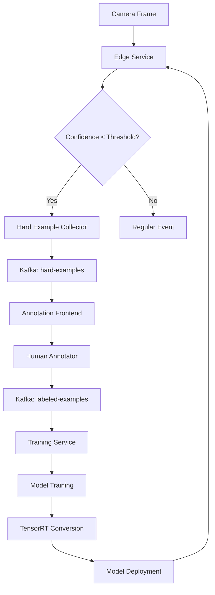

# Continuous Learning Pipeline

This document describes the implementation of the continuous learning pipeline for the surveillance system, which automatically improves AI models by identifying hard examples, collecting human feedback, and retraining models.

## Architecture Overview

The continuous learning pipeline consists of three main services:

```
Edge Service → Hard Example Collector → Annotation Frontend → Training Service
     ↓               ↓                        ↓                    ↓
   Inference    Low-confidence           Human Labels         Model Updates
                 Detections
```

## Services

### 1. Hard Example Collector (`hard_example_collector/`)

**Port**: 8010  
**Purpose**: Identifies and publishes low-confidence detection frames for human review

**Key Features**:
- Consumes camera events from Kafka
- Filters detections based on confidence thresholds:
  - Person: < 0.6
  - Face: < 0.5  
  - Vehicle: < 0.4
- Publishes hard examples with frame data to `hard-examples` topic
- REST API for configuration and statistics

**Endpoints**:
- `GET /health` - Health check
- `GET /stats` - Collection statistics
- `POST /configure` - Update confidence thresholds

### 2. Annotation Frontend (`annotation_frontend/`)

**Port**: 8011  
**Purpose**: Web interface for human annotation of hard examples

**Key Features**:
- Modern Bootstrap-based UI
- Canvas-based annotation tools
- Detection correction workflows
- Quality scoring and annotator tracking
- Real-time consumption of hard examples
- Publishes labeled examples to `labeled-examples` topic

**Interface**:
- Navigate to `http://localhost:8011`
- Review pending hard examples
- Correct bounding boxes and labels
- Assign quality scores
- Submit corrections for training

### 3. Training Service (`training_service/`)

**Port**: 8012  
**Purpose**: Scheduled retraining of AI models using labeled examples

**Key Features**:
- Scheduled training jobs (daily at 2 AM by default)
- Minimum threshold of 50 labeled examples before training
- Complete training pipeline simulation
- TensorRT model conversion
- Model deployment to edge services
- Training job monitoring and logging

**Endpoints**:
- `GET /health` - Health check
- `GET /stats` - Training statistics
- `POST /train` - Manual training trigger
- `GET /jobs/{job_id}` - Job status

## Integration with Edge Service

The edge service has been enhanced to support hard example detection:

### Enhanced Inference Engine

The `EdgeInference` class now includes:
- Kafka producer for publishing hard examples
- Configurable confidence thresholds
- Frame data capture and base64 encoding
- Hard example detection in `infer_objects()` method

### Modified Processing Pipeline

The `process_frame()` function now:
1. Captures frame from camera
2. Applies face anonymization
3. Runs AI inference with hard example detection
4. Publishes both regular events and hard examples
5. Maintains privacy compliance

## Kafka Topics

The pipeline uses the following Kafka topics:

| Topic | Purpose | Retention |
|-------|---------|-----------|
| `hard-examples` | Low-confidence detections | 7 days |
| `labeled-examples` | Human-corrected annotations | 30 days |
| `model-updates` | New trained model notifications | 1 day |
| `camera.events` | All camera events (existing) | 7 days |

## Setup and Usage

### 1. Start the System

```powershell
# Start all services
docker-compose up -d

# Create Kafka topics
.\create_kafka_topics.ps1
```

### 2. Test the Pipeline

```powershell
# Run comprehensive test
.\test_continuous_learning.ps1 -StartServices

# Monitor Kafka topics
.\monitor_kafka_topics.ps1
```

### 3. Generate Hard Examples

```powershell
# Trigger frame processing
Invoke-RestMethod -Uri "http://localhost:8000/capture" -Method POST
```

### 4. Annotate Examples

1. Open the annotation interface: `http://localhost:8011`
2. Review pending hard examples
3. Correct detections using the canvas tools
4. Assign quality scores
5. Submit labeled examples

### 5. Monitor Training

```powershell
# Check training statistics
Invoke-RestMethod -Uri "http://localhost:8012/stats" -Method GET

# Trigger manual training
Invoke-RestMethod -Uri "http://localhost:8012/train" -Method POST
```

## Configuration

### Environment Variables

```bash
# Kafka Configuration
KAFKA_BROKER=kafka:9092

# Hard Example Collector
CONFIDENCE_THRESHOLD_PERSON=0.6
CONFIDENCE_THRESHOLD_FACE=0.5
CONFIDENCE_THRESHOLD_VEHICLE=0.4

# Training Service
TRAINING_SCHEDULE="0 2 * * *"  # Daily at 2 AM
MIN_EXAMPLES_FOR_TRAINING=50

# Topics
HARD_EXAMPLES_TOPIC=hard-examples
LABELED_EXAMPLES_TOPIC=labeled-examples
MODEL_UPDATES_TOPIC=model-updates
```

### Confidence Thresholds

Adjust confidence thresholds based on your model performance:

```python
# Lower thresholds = more hard examples
# Higher thresholds = fewer but higher quality examples
thresholds = {
    'person': 0.6,   # Person detection confidence
    'face': 0.5,     # Face detection confidence  
    'vehicle': 0.4   # Vehicle detection confidence
}
```

## Monitoring and Metrics

### Prometheus Metrics

The services expose metrics for monitoring:

- `hard_examples_collected_total` - Total hard examples collected
- `labeled_examples_processed_total` - Total examples labeled
- `training_jobs_completed_total` - Total training jobs completed
- `model_accuracy_score` - Current model accuracy

### Logs

Monitor service logs:

```powershell
# View logs for specific service
docker-compose logs -f hard_example_collector
docker-compose logs -f annotation_frontend
docker-compose logs -f training_service
```

## Data Flow



## Security Considerations

- **Privacy**: Frame data is anonymized before processing
- **Access Control**: Annotation interface should be secured
- **Data Retention**: Automatic cleanup of old training data
- **Model Validation**: Trained models are validated before deployment

## Troubleshooting

### Common Issues

1. **Kafka Connection Errors**
   ```powershell
   # Check Kafka status
   docker-compose ps kafka
   
   # Recreate topics
   .\create_kafka_topics.ps1
   ```

2. **No Hard Examples Generated**
   ```powershell
   # Check confidence thresholds
   Invoke-RestMethod -Uri "http://localhost:8010/stats" -Method GET
   
   # Lower thresholds to generate more examples
   ```

3. **Training Not Starting**
   ```powershell
   # Check minimum examples threshold
   Invoke-RestMethod -Uri "http://localhost:8012/stats" -Method GET
   
   # Trigger manual training
   Invoke-RestMethod -Uri "http://localhost:8012/train" -Method POST
   ```

### Debug Mode

Enable debug logging:

```yaml
environment:
  - LOG_LEVEL=DEBUG
```

## Future Enhancements

- [ ] Active learning strategy optimization
- [ ] Multi-model training support
- [ ] Federated learning across multiple edge devices
- [ ] Automated model A/B testing
- [ ] Advanced annotation tools (polygon, keypoints)
- [ ] Model performance tracking and rollback
- [ ] Automated quality assessment of annotations
