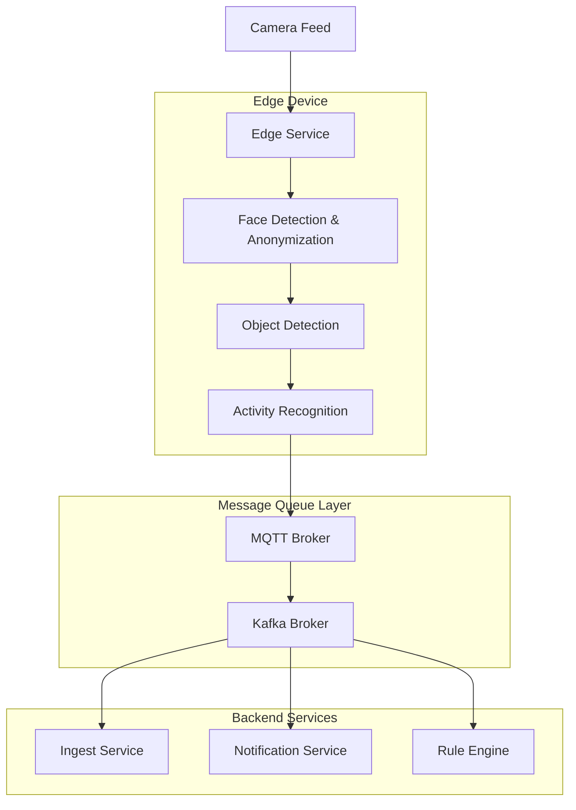

# Edge Service Integration Guide

## Overview

The Edge Service acts as a critical component in the surveillance system pipeline, processing video frames with AI inference while maintaining privacy compliance through on-device face anonymization.

## Architecture Diagram



## Integration Flow

### 1. Data Flow Pipeline

```
Camera → Edge Service → MQTT → Kafka → Backend Services
```

1. **Camera Capture**: Edge service captures frames from connected camera
2. **Privacy Processing**: Faces are detected and anonymized on-device
3. **AI Inference**: Object detection and activity recognition
4. **Event Publishing**: Results published to MQTT broker
5. **Message Routing**: MQTT bridge forwards to Kafka
6. **Backend Processing**: Downstream services consume from Kafka

### 2. Message Schemas

#### Camera Event Schema
```json
{
  "camera_id": "camera-01",
  "event_type": "DETECTION",
  "timestamp": "2024-01-15T10:30:00Z",
  "event_id": "evt_123456789",
  "detections": [
    {
      "label": "person",
      "confidence": 0.95,
      "bbox": {
        "x": 100,
        "y": 150,
        "width": 80,
        "height": 120
      }
    }
  ],
  "activity": {
    "type": "walking",
    "confidence": 0.87
  },
  "privacy": {
    "faces_anonymized": 1,
    "anonymization_method": "blur",
    "privacy_level": "strict",
    "face_hashes": []
  },
  "metadata": {
    "frame_size": [640, 480],
    "processing_time_ms": 45.2
  }
}
```

#### Activity Event Schema
```json
{
  "camera_id": "camera-01",
  "event_type": "ACTIVITY",
  "timestamp": "2024-01-15T10:30:00Z",
  "event_id": "evt_123456790",
  "activity": {
    "type": "loitering",
    "confidence": 0.82,
    "duration_seconds": 15.5
  },
  "privacy": {
    "faces_anonymized": 0,
    "anonymization_method": "blur",
    "privacy_level": "strict"
  }
}
```

## MQTT Configuration

### Topics Structure

| Topic Pattern | Description | QoS | Retained |
|---------------|-------------|-----|----------|
| `camera/events/{camera_id}` | Camera events (detections/activities) | 1 | false |
| `camera/health/{camera_id}` | Health status updates | 1 | true |
| `camera/privacy/{camera_id}` | Privacy compliance events | 2 | false |
| `camera/metrics/{camera_id}` | Performance metrics | 0 | false |

### Security Settings

```bash
# TLS Configuration
MQTT_BROKER=mqtt.surveillance.local
MQTT_PORT=8883
MQTT_TLS_CA=/certs/ca.crt
MQTT_TLS_CERT=/certs/client.crt
MQTT_TLS_KEY=/certs/client.key

# Authentication
MQTT_USERNAME=edge-service
MQTT_PASSWORD=secure_password

# Connection Settings
MQTT_KEEPALIVE=60
MQTT_CLIENT_ID=edge-{camera_id}
```

### QoS Levels

- **QoS 0**: Metrics and heartbeat messages
- **QoS 1**: Event data and health status
- **QoS 2**: Privacy compliance and audit events

## Downstream Integration

### 1. MQTT Subscribers

#### Python Example
```python
import paho.mqtt.client as mqtt
import json
from typing import Dict, Any

class CameraEventSubscriber:
    def __init__(self, broker_host: str, broker_port: int = 8883):
        self.client = mqtt.Client()
        self.client.on_connect = self.on_connect
        self.client.on_message = self.on_message
        
        # Configure TLS
        self.client.tls_set(
            ca_certs="/certs/ca.crt",
            certfile="/certs/client.crt",
            keyfile="/certs/client.key"
        )
        
        self.client.connect(broker_host, broker_port, 60)
    
    def on_connect(self, client, userdata, flags, rc):
        print(f"Connected with result code {rc}")
        # Subscribe to all camera events
        client.subscribe("camera/events/+", qos=1)
        client.subscribe("camera/privacy/+", qos=2)
    
    def on_message(self, client, userdata, msg):
        try:
            topic_parts = msg.topic.split('/')
            camera_id = topic_parts[-1]
            event_type = topic_parts[1]  # events, privacy, health, metrics
            
            payload = json.loads(msg.payload.decode())
            
            if event_type == "events":
                self.handle_camera_event(camera_id, payload)
            elif event_type == "privacy":
                self.handle_privacy_event(camera_id, payload)
                
        except Exception as e:
            print(f"Error processing message: {e}")
    
    def handle_camera_event(self, camera_id: str, event: Dict[str, Any]):
        """Process camera detection/activity events"""
        print(f"Camera {camera_id}: {event['event_type']}")
        
        # Check privacy compliance
        if 'privacy' in event:
            privacy_info = event['privacy']
            if privacy_info['faces_anonymized'] > 0:
                print(f"Privacy protected: {privacy_info['faces_anonymized']} faces anonymized")
        
        # Process detections
        if event.get('detections'):
            for detection in event['detections']:
                print(f"Detected: {detection['label']} ({detection['confidence']:.2f})")
        
        # Process activities
        if event.get('activity'):
            activity = event['activity']
            print(f"Activity: {activity['type']} ({activity['confidence']:.2f})")
    
    def handle_privacy_event(self, camera_id: str, event: Dict[str, Any]):
        """Process privacy compliance events"""
        print(f"Privacy event from {camera_id}: {event}")
    
    def start(self):
        self.client.loop_forever()

# Usage
subscriber = CameraEventSubscriber("mqtt.surveillance.local")
subscriber.start()
```

#### Node.js Example
```javascript
const mqtt = require('mqtt');
const fs = require('fs');

const options = {
  host: 'mqtt.surveillance.local',
  port: 8883,
  protocol: 'mqtts',
  ca: fs.readFileSync('/certs/ca.crt'),
  cert: fs.readFileSync('/certs/client.crt'),
  key: fs.readFileSync('/certs/client.key'),
  rejectUnauthorized: true
};

const client = mqtt.connect(options);

client.on('connect', () => {
  console.log('Connected to MQTT broker');
  
  // Subscribe to camera events
  client.subscribe('camera/events/+', { qos: 1 });
  client.subscribe('camera/privacy/+', { qos: 2 });
});

client.on('message', (topic, message) => {
  try {
    const topicParts = topic.split('/');
    const cameraId = topicParts[topicParts.length - 1];
    const eventType = topicParts[1];
    
    const payload = JSON.parse(message.toString());
    
    switch(eventType) {
      case 'events':
        handleCameraEvent(cameraId, payload);
        break;
      case 'privacy':
        handlePrivacyEvent(cameraId, payload);
        break;
      default:
        console.log(`Unknown event type: ${eventType}`);
    }
  } catch (error) {
    console.error('Error processing message:', error);
  }
});

function handleCameraEvent(cameraId, event) {
  console.log(`Camera ${cameraId}: ${event.event_type}`);
  
  // Check privacy compliance
  if (event.privacy && event.privacy.faces_anonymized > 0) {
    console.log(`Privacy protected: ${event.privacy.faces_anonymized} faces anonymized`);
  }
  
  // Process detections
  if (event.detections) {
    event.detections.forEach(detection => {
      console.log(`Detected: ${detection.label} (${detection.confidence.toFixed(2)})`);
    });
  }
}

function handlePrivacyEvent(cameraId, event) {
  console.log(`Privacy event from ${cameraId}:`, event);
}
```

### 2. Kafka Integration

The MQTT-Kafka bridge forwards messages to Kafka topics for scalable backend processing.

#### Kafka Topic Mapping

| MQTT Topic | Kafka Topic | Partition Key |
|------------|-------------|---------------|
| `camera/events/{camera_id}` | `camera-events` | `camera_id` |
| `camera/privacy/{camera_id}` | `privacy-compliance` | `camera_id` |
| `camera/health/{camera_id}` | `system-health` | `camera_id` |
| `camera/metrics/{camera_id}` | `performance-metrics` | `camera_id` |

#### Kafka Consumer Example
```python
from confluent_kafka import Consumer
import json

def create_kafka_consumer():
    config = {
        'bootstrap.servers': 'kafka:9092',
        'group.id': 'camera-event-processor',
        'auto.offset.reset': 'earliest',
        'enable.auto.commit': True,
        'session.timeout.ms': 6000,
        'heartbeat.interval.ms': 2000
    }
    
    consumer = Consumer(config)
    consumer.subscribe(['camera-events', 'privacy-compliance'])
    
    try:
        while True:
            msg = consumer.poll(timeout=1.0)
            if msg is None:
                continue
            
            if msg.error():
                print(f"Consumer error: {msg.error()}")
                continue
            
            topic = msg.topic()
            key = msg.key().decode('utf-8') if msg.key() else None
            value = json.loads(msg.value().decode('utf-8'))
            
            process_kafka_message(topic, key, value)
            
    except KeyboardInterrupt:
        print("Stopping consumer...")
    finally:
        consumer.close()

def process_kafka_message(topic: str, key: str, message: dict):
    """Process messages from Kafka topics"""
    if topic == 'camera-events':
        handle_camera_event(key, message)
    elif topic == 'privacy-compliance':
        handle_privacy_compliance(key, message)

def handle_camera_event(camera_id: str, event: dict):
    """Process camera events from Kafka"""
    print(f"Processing event from {camera_id}: {event['event_type']}")
    
    # Store in database
    # Trigger notifications
    # Update analytics

def handle_privacy_compliance(camera_id: str, event: dict):
    """Process privacy compliance events"""
    print(f"Privacy compliance event from {camera_id}")
    
    # Log compliance metrics
    # Update privacy dashboard
    # Generate audit trail

if __name__ == "__main__":
    create_kafka_consumer()
```

## Error Handling & Resilience

### 1. Connection Failures

```python
# MQTT Connection with automatic reconnection
import paho.mqtt.client as mqtt
import time

class ResilientMQTTClient:
    def __init__(self, broker_host, broker_port=8883):
        self.broker_host = broker_host
        self.broker_port = broker_port
        self.client = None
        self.reconnect_delay = 5
        self.max_reconnect_delay = 60
        
    def setup_client(self):
        self.client = mqtt.Client()
        self.client.on_connect = self.on_connect
        self.client.on_disconnect = self.on_disconnect
        self.client.on_message = self.on_message
        
        # Configure TLS and authentication
        self.client.tls_set(ca_certs="/certs/ca.crt")
        
    def on_connect(self, client, userdata, flags, rc):
        if rc == 0:
            print("Connected successfully")
            self.reconnect_delay = 5  # Reset delay on successful connection
            # Subscribe to topics
            client.subscribe("camera/events/+", qos=1)
        else:
            print(f"Connection failed with code {rc}")
            
    def on_disconnect(self, client, userdata, rc):
        if rc != 0:
            print("Unexpected disconnection. Attempting to reconnect...")
            self.reconnect()
            
    def reconnect(self):
        while True:
            try:
                print(f"Attempting to reconnect in {self.reconnect_delay} seconds...")
                time.sleep(self.reconnect_delay)
                
                self.client.connect(self.broker_host, self.broker_port, 60)
                self.client.loop_start()
                break
                
            except Exception as e:
                print(f"Reconnection failed: {e}")
                self.reconnect_delay = min(self.reconnect_delay * 2, self.max_reconnect_delay)
                
    def start(self):
        self.setup_client()
        self.client.connect(self.broker_host, self.broker_port, 60)
        self.client.loop_forever()
```

### 2. Message Processing Errors

```python
import logging
from typing import Dict, Any

class EventProcessor:
    def __init__(self):
        self.logger = logging.getLogger(__name__)
        self.failed_messages = []
        
    def process_message(self, topic: str, payload: Dict[str, Any]):
        try:
            # Validate message structure
            self.validate_message(payload)
            
            # Process based on event type
            if payload.get('event_type') == 'DETECTION':
                self.process_detection_event(payload)
            elif payload.get('event_type') == 'ACTIVITY':
                self.process_activity_event(payload)
            else:
                raise ValueError(f"Unknown event type: {payload.get('event_type')}")
                
        except Exception as e:
            self.logger.error(f"Failed to process message: {e}")
            self.handle_failed_message(topic, payload, str(e))
            
    def validate_message(self, payload: Dict[str, Any]):
        """Validate message has required fields"""
        required_fields = ['camera_id', 'event_type', 'timestamp', 'event_id']
        
        for field in required_fields:
            if field not in payload:
                raise ValueError(f"Missing required field: {field}")
                
        # Validate privacy compliance
        if 'privacy' in payload:
            privacy = payload['privacy']
            if 'anonymization_method' not in privacy:
                raise ValueError("Missing anonymization method in privacy data")
                
    def handle_failed_message(self, topic: str, payload: Dict[str, Any], error: str):
        """Handle failed message processing"""
        failed_msg = {
            'topic': topic,
            'payload': payload,
            'error': error,
            'timestamp': time.time(),
            'retry_count': 0
        }
        
        self.failed_messages.append(failed_msg)
        
        # Optionally send to dead letter queue
        self.send_to_dlq(failed_msg)
        
    def send_to_dlq(self, failed_msg: Dict[str, Any]):
        """Send failed message to dead letter queue for manual review"""
        # Implementation depends on your message queue system
        pass
```

## Monitoring & Observability

### 1. Health Checks

Regular health checks ensure the integration is working properly:

```bash
# Edge service health
curl -X GET "http://edge-service:8001/health"

# MQTT broker health
mosquitto_sub -h mqtt.surveillance.local -p 8883 \
  --cafile /certs/ca.crt \
  --cert /certs/client.crt \
  --key /certs/client.key \
  -t "camera/health/+" -C 1

# Privacy compliance check
curl -X GET "http://edge-service:8001/api/v1/privacy/status"
```

### 2. Metrics Collection

Key metrics to monitor:

- **Message throughput**: Events per second
- **Processing latency**: Time from capture to publish
- **Privacy compliance**: Face anonymization success rate
- **Connection stability**: MQTT connection uptime
- **Error rates**: Failed message processing

### 3. Alerting Rules

```yaml
# Prometheus alerting rules
groups:
  - name: edge_service_alerts
    rules:
      - alert: EdgeServiceDown
        expr: up{job="edge-service"} == 0
        for: 30s
        labels:
          severity: critical
        annotations:
          summary: "Edge service is down"
          
      - alert: PrivacyComplianceFailure
        expr: rate(anonymization_failures_total[5m]) > 0.1
        for: 1m
        labels:
          severity: warning
        annotations:
          summary: "High face anonymization failure rate"
          
      - alert: MQTTConnectionLost
        expr: mqtt_connected == 0
        for: 15s
        labels:
          severity: critical
        annotations:
          summary: "MQTT connection lost"
```

## Troubleshooting

### Common Issues

1. **MQTT Connection Failures**
   - Check TLS certificates
   - Verify network connectivity
   - Validate broker configuration

2. **Message Schema Validation Errors**
   - Ensure privacy data is included
   - Check required fields are present
   - Validate data types

3. **Privacy Compliance Issues**
   - Verify face detection models are loaded
   - Check anonymization configuration
   - Monitor anonymization failure rates

### Debug Commands

```bash
# Test MQTT connectivity
mosquitto_pub -h mqtt.surveillance.local -p 8883 \
  --cafile /certs/ca.crt \
  --cert /certs/client.crt \
  --key /certs/client.key \
  -t "test/topic" -m "test message"

# Monitor MQTT messages
mosquitto_sub -h mqtt.surveillance.local -p 8883 \
  --cafile /certs/ca.crt \
  --cert /certs/client.crt \
  --key /certs/client.key \
  -t "camera/events/+" -v

# Test edge service endpoints
curl -X POST "http://edge-service:8001/api/v1/capture"
curl -X POST "http://edge-service:8001/api/v1/privacy/test"
```

## Security Considerations

### 1. Network Security
- Use TLS for all MQTT connections
- Implement certificate-based authentication
- Network segmentation for edge devices

### 2. Data Privacy
- Face anonymization is mandatory
- Audit trail for all privacy events
- Secure storage of face hashes (if enabled)

### 3. Access Control
- Role-based access to MQTT topics
- API authentication for edge service
- Monitoring of unauthorized access attempts

## Performance Tuning

### 1. MQTT Optimization
```bash
# High-throughput configuration
MQTT_KEEPALIVE=30
MQTT_MAX_INFLIGHT=100
MQTT_MESSAGE_RETRY_INTERVAL=5
MQTT_RECONNECT_DELAY_MAX=60
```

### 2. Processing Optimization
```bash
# Edge service performance
CAPTURE_DEVICE=0
TARGET_RESOLUTION=416,416  # Smaller for faster processing
ANONYMIZATION_METHOD=black_box  # Fastest method
PRIVACY_LEVEL=moderate  # Balance privacy and performance
```

### 3. Resource Monitoring
Monitor CPU, memory, and network usage to ensure optimal performance without compromising system stability.
