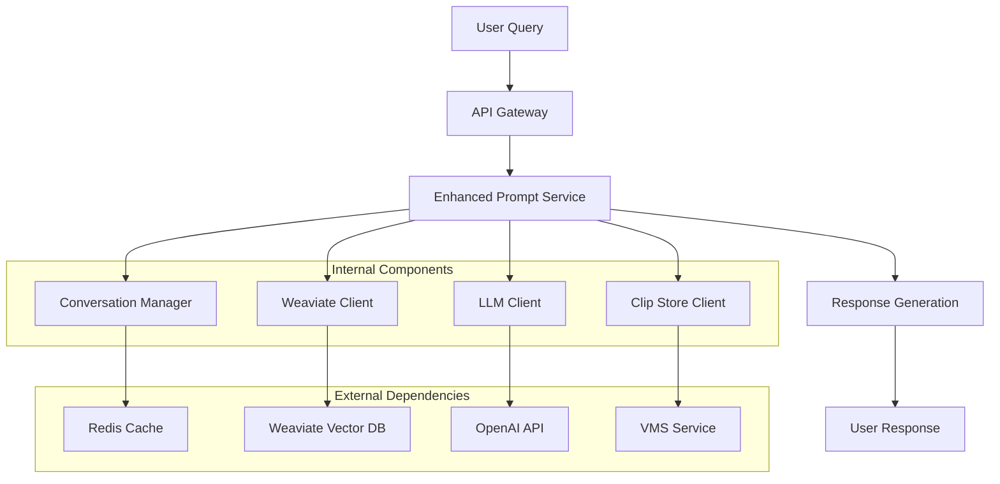
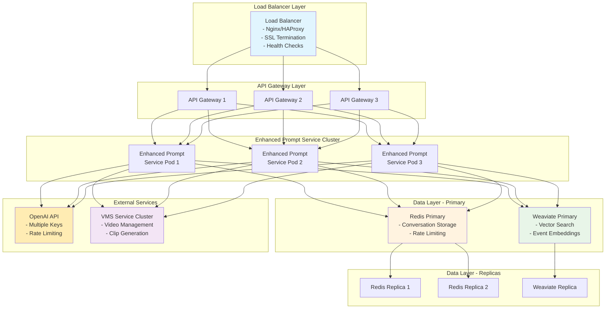

# Enhanced Prompt Service - Architecture Overview

## System Overview

The Enhanced Prompt Service is a microservice that provides intelligent conversational interfaces for surveillance systems. It combines semantic search, large language models, and conversation memory to deliver context-aware AI responses.

## High-Level Architecture

```
┌─────────────────────────────────────────────────────────────────────────────────┐
│                           Enhanced Prompt Service                               │
├─────────────────────────────────────────────────────────────────────────────────┤
│                                                                                 │
│  ┌─────────────────┐    ┌─────────────────┐    ┌─────────────────┐             │
│  │   FastAPI       │    │  Conversation   │    │     LLM         │             │
│  │   Web Server    │    │    Manager      │    │   Client        │             │
│  │                 │    │                 │    │                 │             │
│  │ • REST API      │    │ • Multi-turn    │    │ • OpenAI        │             │
│  │ • Validation    │    │ • Context       │    │ • Prompting     │             │
│  │ • Auth/Rate     │    │ • Memory        │    │ • Follow-ups    │             │
│  │   Limiting     │    │                 │    │                 │             │
│  └─────────────────┘    └─────────────────┘    └─────────────────┘             │
│                                                                                 │
│  ┌─────────────────┐    ┌─────────────────┐    ┌─────────────────┐             │
│  │   Weaviate      │    │   Clip Store    │    │   Shared        │             │
│  │   Client        │    │   Client        │    │   Utilities     │             │
│  │                 │    │                 │    │                 │             │
│  │ • Semantic      │    │ • URL Gen       │    │ • Config        │             │
│  │   Search        │    │ • Metadata      │    │ • Logging       │             │
│  │ • Vector DB     │    │ • Validation    │    │ • Metrics       │             │
│  │                 │    │                 │    │ • Auth          │             │
│  └─────────────────┘    └─────────────────┘    └─────────────────┘             │
│                                                                                 │
└─────────────────────────────────────────────────────────────────────────────────┘
```

## Service Role in Surveillance Ecosystem

The Enhanced Prompt Service serves as the **intelligent interface layer** between users and surveillance data:

1. **Data Aggregation**: Combines information from multiple sources
2. **Context Understanding**: Maintains conversation context and user intent
3. **Intelligent Responses**: Generates human-like responses with actionable insights
4. **Proactive Analysis**: Identifies patterns and anomalies automatically
5. **Integration Hub**: Connects various surveillance system components

## Data Flow Architecture



## Component Architecture

### 1. Web API Layer (`main.py`)

**Responsibilities:**
- HTTP request handling and routing
- Request/response validation
- Authentication and authorization
- Rate limiting and security
- Error handling and logging
- OpenAPI documentation generation

**Key Features:**
- FastAPI framework with automatic validation
- JWT-based authentication
- Rate limiting with Redis backend
- Comprehensive error handling
- Prometheus metrics integration
- Structured logging with correlation IDs

**Endpoints:**
- `POST /api/v1/conversation` - Main conversational interface
- `GET /api/v1/proactive-insights` - Proactive system insights
- `GET /api/v1/conversation/{id}/history` - Conversation history
- `DELETE /api/v1/conversation/{id}` - Conversation cleanup

### 2. Conversation Manager (`conversation_manager.py`)

**Responsibilities:**
- Multi-turn conversation management
- Context preservation across sessions
- Message history storage and retrieval
- Conversation lifecycle management

**Architecture:**
```python
class ConversationManager:
    def __init__(self, redis_client):
        self.redis = redis_client
        self.conversation_ttl = 7 * 24 * 3600  # 7 days
        self.message_ttl = 30 * 24 * 3600      # 30 days
    
    # Core operations
    async def create_conversation(user_id, context)
    async def get_conversation(conversation_id)
    async def add_message(conversation_id, role, content)
    async def get_recent_messages(conversation_id, limit)
```

**Data Models:**
- **Conversation**: Metadata, user context, message count, timestamps
- **Message**: Content, role (user/assistant), metadata, timestamp
- **Context**: User preferences, session state, conversation history

### 3. LLM Client (`llm_client.py`)

**Responsibilities:**
- OpenAI API integration and management
- Prompt engineering and optimization
- Response generation and follow-up questions
- Proactive insight generation

**Architecture:**
```python
# Core functions
def generate_conversational_response(
    query: str,
    conversation_history: List[Dict],
    search_results: List[Dict],
    system_context: Dict
) -> Dict

def generate_follow_up_questions(
    query: str,
    response: str,
    conversation_history: List[Dict],
    search_results: List[Dict]
) -> List[str]
```

**Prompt Engineering:**
- **System Prompts**: Role definition and behavior guidelines
- **Context Integration**: Seamless integration of search results
- **Conversation History**: Maintaining context across turns
- **Follow-up Generation**: Intelligent question suggestions

### 4. Weaviate Client (`weaviate_client.py`)

**Responsibilities:**
- Vector database connectivity and querying
- Semantic search with enhanced features
- Pattern analysis and relationship detection
- Search result ranking and filtering

**Architecture:**
```python
def semantic_search(
    query: str,
    limit: int = 5,
    conversation_context: Optional[List[Dict]] = None,
    filters: Optional[Dict] = None
) -> List[Dict]

def get_related_events(
    event_id: str,
    relation_types: List[str] = ["temporal", "spatial", "semantic"]
) -> List[Dict]
```

**Search Enhancement:**
- **Context-Aware Search**: Uses conversation history for better results
- **Multi-Modal Filtering**: Camera, time, event type, confidence filters
- **Relevance Scoring**: Custom scoring algorithms for result ranking
- **Pattern Detection**: Identifies relationships between events

### 5. Clip Store Client (`clip_store.py`)

**Responsibilities:**
- Video clip URL generation and management
- Metadata retrieval and validation
- Thumbnail generation and caching
- Batch operations for multiple clips

**Architecture:**
```python
def get_clip_url(
    event_id: str,
    expiry_minutes: int = 60,
    include_metadata: bool = False
) -> str

def get_multiple_clip_urls(
    event_ids: List[str],
    expiry_minutes: int = 60
) -> Dict[str, str]
```

**Features:**
- **Fallback Mechanisms**: Multiple strategies for URL generation
- **Expiry Management**: Configurable URL expiration times
- **Metadata Enrichment**: Additional clip information and validation
- **Batch Processing**: Efficient handling of multiple clips

## Infrastructure Architecture

### Deployment Patterns

#### 1. Container-Based Deployment

```yaml
# Docker Compose Example
version: '3.8'
services:
  enhanced-prompt-service:
    image: surveillance/enhanced-prompt-service:latest
    ports:
      - "8000:8000"
    environment:
      - REDIS_URL=redis://redis:6379/0
      - WEAVIATE_URL=http://weaviate:8080
      - OPENAI_API_KEY=${OPENAI_API_KEY}
    depends_on:
      - redis
      - weaviate
    deploy:
      replicas: 3
      resources:
        limits:
          memory: 1G
          cpus: '0.5'
        reservations:
          memory: 512M
          cpus: '0.25'
```

#### 2. Kubernetes Deployment

```yaml
apiVersion: apps/v1
kind: Deployment
metadata:
  name: enhanced-prompt-service
spec:
  replicas: 3
  selector:
    matchLabels:
      app: enhanced-prompt-service
  template:
    spec:
      containers:
      - name: enhanced-prompt-service
        image: surveillance/enhanced-prompt-service:latest
        resources:
          requests:
            memory: "512Mi"
            cpu: "250m"
          limits:
            memory: "1Gi"
            cpu: "500m"
        env:
        - name: REDIS_URL
          valueFrom:
            configMapKeyRef:
              name: app-config
              key: redis-url
```

### Deployment Architecture

### Docker Compose Deployment

```yaml
# docker-compose.yml excerpt for Enhanced Prompt Service
version: '3.8'

services:
  # Enhanced Prompt Service
  enhanced-prompt-service:
    build:
      context: .
      dockerfile: enhanced_prompt_service/Dockerfile
    ports:
      - "8000:8000"
    environment:
      # Core Configuration
      - SERVICE_NAME=enhanced_prompt_service
      - LOG_LEVEL=INFO
      - PORT=8000
      
      # External Dependencies
      - REDIS_URL=redis://redis:6379/0
      - WEAVIATE_URL=http://weaviate:8080
      - OPENAI_API_KEY=${OPENAI_API_KEY}
      - VMS_SERVICE_URL=http://vms-service:8001
      
      # Security
      - JWT_SECRET_KEY=${JWT_SECRET_KEY}
      - RATE_LIMIT_PER_MINUTE=100
      
      # Monitoring
      - ENABLE_METRICS=true
      - METRICS_PORT=9090
    depends_on:
      redis:
        condition: service_healthy
      weaviate:
        condition: service_healthy
      vms-service:
        condition: service_started
    volumes:
      - ./shared:/app/shared:ro
      - ./enhanced_prompt_service/logs:/app/logs
      - ./enhanced_prompt_service/config:/app/config:ro
    networks:
      - surveillance-network
    healthcheck:
      test: ["CMD", "curl", "-f", "http://localhost:8000/health"]
      interval: 30s
      timeout: 10s
      retries: 3
      start_period: 40s
    restart: unless-stopped
    deploy:
      resources:
        limits:
          memory: 2G
          cpus: '1.0'
        reservations:
          memory: 1G
          cpus: '0.5'
    labels:
      # Traefik labels for reverse proxy
      - "traefik.enable=true"
      - "traefik.http.routers.enhanced-prompt.rule=PathPrefix(`/api/v1/enhanced-prompt`)"

  # Redis for conversation memory
  redis:
    image: redis:7-alpine
    ports:
      - "6379:6379"
    command: redis-server --appendonly yes --requirepass ${REDIS_PASSWORD}
    volumes:
      - redis-data:/data
    healthcheck:
      test: ["CMD", "redis-cli", "ping"]
      interval: 10s
      timeout: 5s
      retries: 5
    restart: unless-stopped

  # Weaviate vector database
  weaviate:
    image: semitechnologies/weaviate:1.21.2
    ports:
      - "8080:8080"
    environment:
      QUERY_DEFAULTS_LIMIT: 25
      AUTHENTICATION_ANONYMOUS_ACCESS_ENABLED: 'false'
      AUTHENTICATION_APIKEY_ENABLED: 'true'
      AUTHENTICATION_APIKEY_ALLOWED_KEYS: '${WEAVIATE_API_KEY}'
      AUTHORIZATION_ADMINLIST_ENABLED: 'true'
      AUTHORIZATION_ADMINLIST_USERS: 'admin'
      PERSISTENCE_DATA_PATH: '/var/lib/weaviate'
      DEFAULT_VECTORIZER_MODULE: 'none'
      ENABLE_MODULES: 'text2vec-openai'
      CLUSTER_HOSTNAME: 'node1'
    volumes:
      - weaviate-data:/var/lib/weaviate
    healthcheck:
      test: ["CMD", "wget", "--no-verbose", "--tries=3", "--spider", "http://localhost:8080/v1/.well-known/ready"]
      interval: 30s
      timeout: 10s
      retries: 3
    restart: unless-stopped

volumes:
  redis-data:
  weaviate-data:

networks:
  surveillance-network:
    driver: bridge
```

### Kubernetes Deployment

```yaml
# k8s/enhanced-prompt-service-deployment.yaml
apiVersion: apps/v1
kind: Deployment
metadata:
  name: enhanced-prompt-service
  namespace: surveillance-system
  labels:
    app: enhanced-prompt-service
    version: v1.3.0
spec:
  replicas: 3
  strategy:
    type: RollingUpdate
    rollingUpdate:
      maxSurge: 1
      maxUnavailable: 0
  selector:
    matchLabels:
      app: enhanced-prompt-service
  template:
    metadata:
      labels:
        app: enhanced-prompt-service
        version: v1.3.0
      annotations:
        prometheus.io/scrape: "true"
        prometheus.io/port: "9090"
        prometheus.io/path: "/metrics"
    spec:
      serviceAccountName: enhanced-prompt-service
      containers:
      - name: enhanced-prompt-service
        image: surveillance-system/enhanced-prompt-service:v1.3.0
        ports:
        - containerPort: 8000
          name: http
        - containerPort: 9090
          name: metrics
        env:
        - name: SERVICE_NAME
          value: enhanced_prompt_service
        - name: LOG_LEVEL
          value: INFO
        - name: PORT
          value: "8000"
        - name: REDIS_URL
          valueFrom:
            secretKeyRef:
              name: enhanced-prompt-secrets
              key: redis-url
        - name: WEAVIATE_URL
          value: http://weaviate-service:8080
        - name: OPENAI_API_KEY
          valueFrom:
            secretKeyRef:
              name: enhanced-prompt-secrets
              key: openai-api-key
        - name: JWT_SECRET_KEY
          valueFrom:
            secretKeyRef:
              name: enhanced-prompt-secrets
              key: jwt-secret-key
        resources:
          requests:
            memory: "1Gi"
            cpu: "500m"
          limits:
            memory: "2Gi"
            cpu: "1000m"
        livenessProbe:
          httpGet:
            path: /health
            port: 8000
          initialDelaySeconds: 30
          periodSeconds: 10
          timeoutSeconds: 5
          failureThreshold: 3
        readinessProbe:
          httpGet:
            path: /health
            port: 8000
          initialDelaySeconds: 5
          periodSeconds: 5
          timeoutSeconds: 3
          failureThreshold: 3
        volumeMounts:
        - name: config
          mountPath: /app/config
          readOnly: true
        - name: logs
          mountPath: /app/logs
      volumes:
      - name: config
        configMap:
          name: enhanced-prompt-config
      - name: logs
        emptyDir: {}
      imagePullSecrets:
      - name: registry-credentials

---
apiVersion: v1
kind: Service
metadata:
  name: enhanced-prompt-service
  namespace: surveillance-system
  labels:
    app: enhanced-prompt-service
spec:
  selector:
    app: enhanced-prompt-service
  ports:
  - name: http
    port: 8000
    targetPort: 8000
  - name: metrics
    port: 9090
    targetPort: 9090
  type: ClusterIP

---
apiVersion: v1
kind: ConfigMap
metadata:
  name: enhanced-prompt-config
  namespace: surveillance-system
data:
  service.yaml: |
    service:
      name: enhanced_prompt_service
      version: 1.3.0
      port: 8000
    
    conversation:
      ttl_days: 7
      max_history: 50
      
    llm:
      model: gpt-4
      max_tokens: 2000
      temperature: 0.7
      
    search:
      default_limit: 5
      max_limit: 50
      confidence_threshold: 0.7
      
    rate_limiting:
      per_minute: 100
      burst: 20

---
apiVersion: v1
kind: Secret
metadata:
  name: enhanced-prompt-secrets
  namespace: surveillance-system
type: Opaque
data:
  redis-url: <base64-encoded-redis-url>
  openai-api-key: <base64-encoded-openai-key>
  jwt-secret-key: <base64-encoded-jwt-secret>
```

### Production Deployment Considerations

#### High Availability Setup



#### Scaling Configuration

**Horizontal Pod Autoscaler (HPA):**
```yaml
apiVersion: autoscaling/v2
kind: HorizontalPodAutoscaler
metadata:
  name: enhanced-prompt-service-hpa
  namespace: surveillance-system
spec:
  scaleTargetRef:
    apiVersion: apps/v1
    kind: Deployment
    name: enhanced-prompt-service
  minReplicas: 3
  maxReplicas: 10
  metrics:
  - type: Resource
    resource:
      name: cpu
      target:
        type: Utilization
        averageUtilization: 70
  - type: Resource
    resource:
      name: memory
      target:
        type: Utilization
        averageUtilization: 80
  - type: Object
    object:
      metric:
        name: requests_per_second
      target:
        type: AverageValue
        averageValue: "50"
  behavior:
    scaleUp:
      stabilizationWindowSeconds: 60
      policies:
      - type: Percent
        value: 100
        periodSeconds: 15
    scaleDown:
      stabilizationWindowSeconds: 300
      policies:
      - type: Percent
        value: 10
        periodSeconds: 60
```
