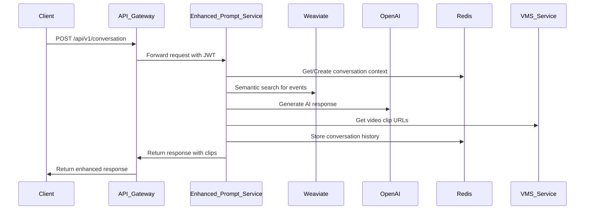
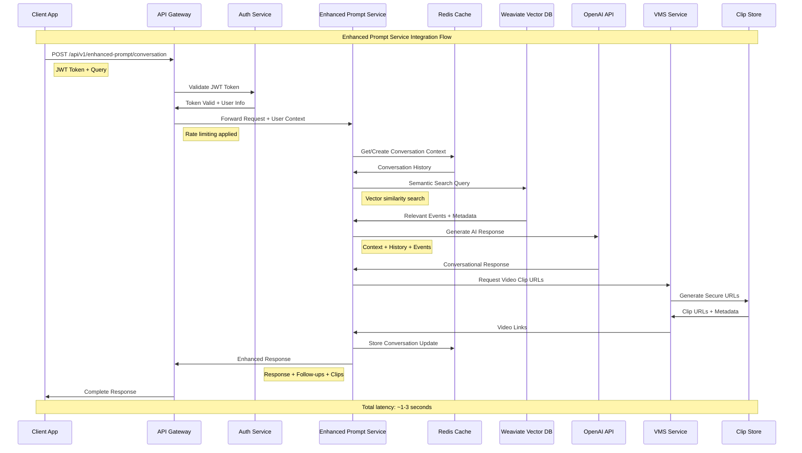
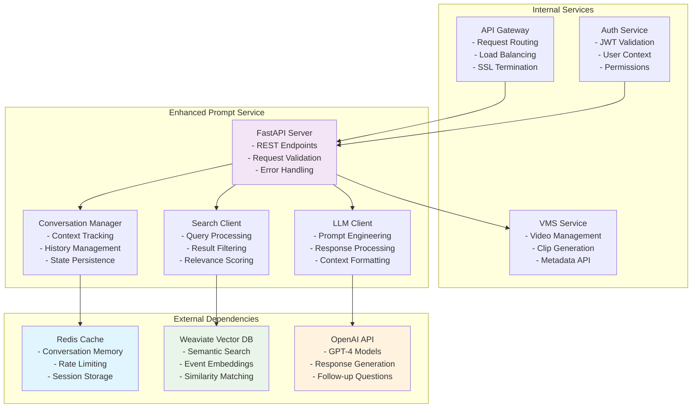
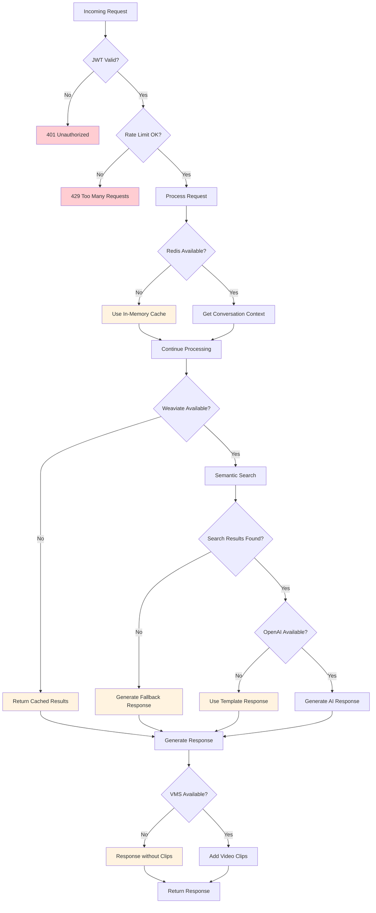

# Enhanced Prompt Service - Integration Guide

## Overview

This guide covers how to integrate the Enhanced Prompt Service into the surveillance system ecosystem and with external applications. The service acts as an intelligent interface layer between users and surveillance data.

## System Architecture



## Detailed Integration Flows

### Complete Request Flow Diagram



### Service Dependencies Integration



### Error Handling and Fault Tolerance



## Configuration

### Environment Variables

The service requires the following environment variables:

#### Core Service Configuration

```bash
# Service Identity
SERVICE_NAME=enhanced_prompt_service
SERVICE_VERSION=1.3.0
LOG_LEVEL=INFO

# Network Configuration
PORT=8000
HOST=0.0.0.0
ROOT_PATH=/api/v1

# Performance Tuning
WORKERS=4
MAX_CONNECTIONS=1000
KEEPALIVE_TIMEOUT=5
```

#### Database & Caching

```bash
# Redis Configuration (Conversation Memory)
REDIS_URL=redis://redis:6379/0
REDIS_PASSWORD=your_redis_password
REDIS_MAX_CONNECTIONS=20
REDIS_CONNECTION_TIMEOUT=5

# Conversation Settings
CONVERSATION_TTL_DAYS=7
MESSAGE_TTL_DAYS=30
MAX_CONVERSATION_HISTORY=50
```

#### AI & Search Configuration

```bash
# OpenAI Configuration
OPENAI_API_KEY=sk-your-openai-api-key
OPENAI_MODEL=gpt-4
OPENAI_MAX_TOKENS=2000
OPENAI_TEMPERATURE=0.7
OPENAI_TIMEOUT=30

# Weaviate Configuration
WEAVIATE_URL=http://weaviate:8080
WEAVIATE_API_KEY=your_weaviate_api_key
WEAVIATE_TIMEOUT=10
WEAVIATE_BATCH_SIZE=100

# Search Configuration
DEFAULT_SEARCH_LIMIT=5
MAX_SEARCH_LIMIT=50
SEARCH_CONFIDENCE_THRESHOLD=0.7
```

#### Video & Clip Integration

```bash
# VMS Service Integration
VMS_SERVICE_URL=http://vms-service:8001
VMS_SERVICE_TIMEOUT=10
VMS_SERVICE_API_KEY=your_vms_api_key

# Clip Configuration
CLIP_BASE_URL=http://vms-service:8001/clips
DEFAULT_CLIP_EXPIRY_MINUTES=60
MAX_CLIP_EXPIRY_HOURS=24
THUMBNAIL_BASE_URL=http://vms-service:8001/thumbnails
```

#### Security & Authentication

```bash
# JWT Configuration
JWT_SECRET_KEY=your-jwt-secret-key
JWT_ALGORITHM=HS256
JWT_EXPIRATION_HOURS=24

# Rate Limiting
RATE_LIMIT_PER_MINUTE=100
RATE_LIMIT_BURST=20
RATE_LIMIT_STORAGE=redis

# CORS Configuration
CORS_ORIGINS=["http://localhost:3000", "https://your-dashboard.com"]
CORS_METHODS=["GET", "POST", "DELETE"]
CORS_HEADERS=["Authorization", "Content-Type"]
```

### Configuration File Example

Create a `.env` file in the service directory:

```bash
# Enhanced Prompt Service Configuration
# Copy this to .env and customize for your environment

# === CORE SERVICE ===
SERVICE_NAME=enhanced_prompt_service
LOG_LEVEL=INFO
PORT=8000

# === REDIS (CONVERSATION MEMORY) ===
REDIS_URL=redis://redis:6379/0
CONVERSATION_TTL_DAYS=7

# === AI SERVICES ===
OPENAI_API_KEY=sk-your-openai-api-key-here
OPENAI_MODEL=gpt-4
WEAVIATE_URL=http://weaviate:8080

# === VIDEO INTEGRATION ===
VMS_SERVICE_URL=http://vms-service:8001
CLIP_BASE_URL=http://vms-service:8001/clips

# === SECURITY ===
JWT_SECRET_KEY=your-super-secure-jwt-secret-key
RATE_LIMIT_PER_MINUTE=100

# === MONITORING ===
ENABLE_METRICS=true
METRICS_PORT=9090
```

## Docker Integration

### Docker Compose Integration

Add the Enhanced Prompt Service to your `docker-compose.yml`:

```yaml
version: '3.8'

services:
  enhanced-prompt-service:
    build:
      context: .
      dockerfile: enhanced_prompt_service/Dockerfile
    ports:
      - "8000:8000"
    environment:
      - REDIS_URL=redis://redis:6379/0
      - WEAVIATE_URL=http://weaviate:8080
      - VMS_SERVICE_URL=http://vms-service:8001
      - OPENAI_API_KEY=${OPENAI_API_KEY}
      - JWT_SECRET_KEY=${JWT_SECRET_KEY}
    depends_on:
      - redis
      - weaviate
      - vms-service
    volumes:
      - ./shared:/app/shared:ro
      - ./enhanced_prompt_service/logs:/app/logs
    networks:
      - surveillance-network
    healthcheck:
      test: ["CMD", "curl", "-f", "http://localhost:8000/health"]
      interval: 30s
      timeout: 10s
      retries: 3
      start_period: 40s
    restart: unless-stopped
    labels:
      - "traefik.enable=true"
      - "traefik.http.routers.enhanced-prompt.rule=PathPrefix(`/api/v1/conversation`) || PathPrefix(`/api/v1/proactive-insights`)"
      - "traefik.http.services.enhanced-prompt.loadbalancer.server.port=8000"

  # Dependencies
  redis:
    image: redis:7-alpine
    volumes:
      - redis_data:/data
    networks:
      - surveillance-network

  weaviate:
    image: semitechnologies/weaviate:1.22.4
    environment:
      - QUERY_DEFAULTS_LIMIT=25
      - AUTHENTICATION_ANONYMOUS_ACCESS_ENABLED=true
      - PERSISTENCE_DATA_PATH=/var/lib/weaviate
    volumes:
      - weaviate_data:/var/lib/weaviate
    networks:
      - surveillance-network

volumes:
  redis_data:
  weaviate_data:

networks:
  surveillance-network:
    external: true
```

### Kubernetes Deployment

For Kubernetes deployments, create the following manifests:

#### Deployment

```yaml
apiVersion: apps/v1
kind: Deployment
metadata:
  name: enhanced-prompt-service
  labels:
    app: enhanced-prompt-service
spec:
  replicas: 3
  selector:
    matchLabels:
      app: enhanced-prompt-service
  template:
    metadata:
      labels:
        app: enhanced-prompt-service
    spec:
      containers:
      - name: enhanced-prompt-service
        image: surveillance/enhanced-prompt-service:latest
        ports:
        - containerPort: 8000
        env:
        - name: REDIS_URL
          value: "redis://redis-service:6379/0"
        - name: WEAVIATE_URL
          value: "http://weaviate-service:8080"
        - name: OPENAI_API_KEY
          valueFrom:
            secretKeyRef:
              name: ai-secrets
              key: openai-api-key
        - name: JWT_SECRET_KEY
          valueFrom:
            secretKeyRef:
              name: auth-secrets
              key: jwt-secret
        resources:
          requests:
            memory: "512Mi"
            cpu: "250m"
          limits:
            memory: "1Gi"
            cpu: "500m"
        livenessProbe:
          httpGet:
            path: /health
            port: 8000
          initialDelaySeconds: 30
          periodSeconds: 10
        readinessProbe:
          httpGet:
            path: /health
            port: 8000
          initialDelaySeconds: 5
          periodSeconds: 5
```

#### Service

```yaml
apiVersion: v1
kind: Service
metadata:
  name: enhanced-prompt-service
spec:
  selector:
    app: enhanced-prompt-service
  ports:
  - protocol: TCP
    port: 8000
    targetPort: 8000
  type: ClusterIP
```

## API Gateway Integration

### Nginx Configuration

If using Nginx as an API gateway:

```nginx
upstream enhanced_prompt_service {
    server enhanced-prompt-service:8000;
    keepalive 32;
}

server {
    listen 80;
    server_name api.surveillance-system.com;

    # Enhanced Prompt Service endpoints
    location /api/v1/conversation {
        proxy_pass http://enhanced_prompt_service;
        proxy_http_version 1.1;
        proxy_set_header Upgrade $http_upgrade;
        proxy_set_header Connection 'upgrade';
        proxy_set_header Host $host;
        proxy_set_header X-Real-IP $remote_addr;
        proxy_set_header X-Forwarded-For $proxy_add_x_forwarded_for;
        proxy_set_header X-Forwarded-Proto $scheme;
        proxy_cache_bypass $http_upgrade;
        
        # Timeout settings for AI responses
        proxy_connect_timeout 10s;
        proxy_send_timeout 60s;
        proxy_read_timeout 60s;
    }

    location /api/v1/proactive-insights {
        proxy_pass http://enhanced_prompt_service;
        proxy_http_version 1.1;
        proxy_set_header Host $host;
        proxy_set_header X-Real-IP $remote_addr;
        proxy_set_header X-Forwarded-For $proxy_add_x_forwarded_for;
        proxy_set_header X-Forwarded-Proto $scheme;
        
        # Cache proactive insights for 5 minutes
        proxy_cache api_cache;
        proxy_cache_valid 200 5m;
        proxy_cache_key "$scheme$request_method$host$request_uri";
        add_header X-Cache-Status $upstream_cache_status;
    }
}
```

### Traefik Configuration

For Traefik-based routing:

```yaml
# traefik.yml
http:
  routers:
    enhanced-prompt-service:
      rule: "PathPrefix(`/api/v1/conversation`) || PathPrefix(`/api/v1/proactive-insights`)"
      service: enhanced-prompt-service
      middlewares:
        - auth-jwt
        - rate-limit
        - cors-headers

  services:
    enhanced-prompt-service:
      loadBalancer:
        servers:
        - url: "http://enhanced-prompt-service:8000"
        healthCheck:
          path: "/health"
          interval: "30s"
          timeout: "5s"

  middlewares:
    rate-limit:
      rateLimit:
        burst: 20
        average: 100
        period: "1m"
        
    cors-headers:
      headers:
        accessControlAllowMethods:
          - GET
          - POST
          - DELETE
        accessControlAllowOriginList:
          - "http://localhost:3000"
          - "https://dashboard.surveillance-system.com"
        accessControlAllowHeaders:
          - "Authorization"
          - "Content-Type"
```

## Frontend Integration

### JavaScript/TypeScript Client

```typescript
// Enhanced Prompt Service Client
class EnhancedPromptClient {
    private baseUrl: string;
    private token: string;

    constructor(baseUrl: string, token: string) {
        this.baseUrl = baseUrl;
        this.token = token;
    }

    async sendQuery(query: string, conversationId?: string): Promise<ConversationResponse> {
        const response = await fetch(`${this.baseUrl}/api/v1/conversation`, {
            method: 'POST',
            headers: {
                'Content-Type': 'application/json',
                'Authorization': `Bearer ${this.token}`
            },
            body: JSON.stringify({
                query,
                conversation_id: conversationId,
                limit: 10
            })
        });

        if (!response.ok) {
            throw new Error(`API Error: ${response.status}`);
        }

        return response.json();
    }

    async getProactiveInsights(timeRange: string = '24h'): Promise<ConversationResponse[]> {
        const response = await fetch(
            `${this.baseUrl}/api/v1/proactive-insights?time_range=${timeRange}`,
            {
                headers: {
                    'Authorization': `Bearer ${this.token}`
                }
            }
        );

        if (!response.ok) {
            throw new Error(`API Error: ${response.status}`);
        }

        return response.json();
    }

    async getConversationHistory(conversationId: string): Promise<ConversationHistory> {
        const response = await fetch(
            `${this.baseUrl}/api/v1/conversation/${conversationId}/history`,
            {
                headers: {
                    'Authorization': `Bearer ${this.token}`
                }
            }
        );

        if (!response.ok) {
            throw new Error(`API Error: ${response.status}`);
        }

        return response.json();
    }
}

// Usage example
const client = new EnhancedPromptClient('http://localhost:8000', 'your-jwt-token');

// Send a query
const response = await client.sendQuery('Show me security incidents from today');
console.log('AI Response:', response.response);
console.log('Follow-up questions:', response.follow_up_questions);

// Get proactive insights
const insights = await client.getProactiveInsights('7d');
insights.forEach(insight => {
    console.log('Insight:', insight.response);
});
```

### React Component Example

```tsx
import React, { useState, useEffect } from 'react';
import { EnhancedPromptClient } from './EnhancedPromptClient';

interface ChatMessage {
    role: 'user' | 'assistant';
    content: string;
    timestamp: Date;
    followUps?: string[];
    evidence?: any[];
    clipLinks?: any[];
}

export const EnhancedChatInterface: React.FC = () => {
    const [client] = useState(() => new EnhancedPromptClient(
        process.env.REACT_APP_API_URL!,
        localStorage.getItem('jwt_token')!
    ));
    
    const [messages, setMessages] = useState<ChatMessage[]>([]);
    const [input, setInput] = useState('');
    const [conversationId, setConversationId] = useState<string | null>(null);
    const [loading, setLoading] = useState(false);

    const sendMessage = async () => {
        if (!input.trim() || loading) return;

        const userMessage: ChatMessage = {
            role: 'user',
            content: input,
            timestamp: new Date()
        };

        setMessages(prev => [...prev, userMessage]);
        setInput('');
        setLoading(true);

        try {
            const response = await client.sendQuery(input, conversationId || undefined);
            
            if (!conversationId) {
                setConversationId(response.conversation_id);
            }

            const assistantMessage: ChatMessage = {
                role: 'assistant',
                content: response.response,
                timestamp: new Date(),
                followUps: response.follow_up_questions,
                evidence: response.evidence,
                clipLinks: response.clip_links
            };

            setMessages(prev => [...prev, assistantMessage]);
        } catch (error) {
            console.error('Failed to send message:', error);
        } finally {
            setLoading(false);
        }
    };

    const handleFollowUp = (question: string) => {
        setInput(question);
    };

    return (
        <div className="chat-interface">
            <div className="messages">
                {messages.map((message, index) => (
                    <div key={index} className={`message ${message.role}`}>
                        <div className="content">{message.content}</div>
                        
                        {message.clipLinks && message.clipLinks.length > 0 && (
                            <div className="clip-links">
                                <h4>Related Video Clips:</h4>
                                {message.clipLinks.map((clip, clipIndex) => (
                                    <a 
                                        key={clipIndex} 
                                        href={clip.url} 
                                        target="_blank" 
                                        rel="noopener noreferrer"
                                        className="clip-link"
                                    >
                                        📹 {clip.camera_id} - {new Date(clip.timestamp).toLocaleString()}
                                    </a>
                                ))}
                            </div>
                        )}
                        
                        {message.followUps && message.followUps.length > 0 && (
                            <div className="follow-ups">
                                <h4>Suggested Questions:</h4>
                                {message.followUps.map((question, qIndex) => (
                                    <button
                                        key={qIndex}
                                        onClick={() => handleFollowUp(question)}
                                        className="follow-up-button"
                                    >
                                        {question}
                                    </button>
                                ))}
                            </div>
                        )}
                    </div>
                ))}
            </div>
            
            <div className="input-area">
                <input
                    type="text"
                    value={input}
                    onChange={(e) => setInput(e.target.value)}
                    onKeyPress={(e) => e.key === 'Enter' && sendMessage()}
                    placeholder="Ask about security events..."
                    disabled={loading}
                />
                <button onClick={sendMessage} disabled={loading || !input.trim()}>
                    {loading ? 'Sending...' : 'Send'}
                </button>
            </div>
        </div>
    );
};
```

## Integration Patterns

### Event-Driven Integration

For real-time integration with the surveillance system:

```python
# Event handler for new surveillance events
async def handle_new_event(event_data):
    """Process new surveillance events and generate proactive insights."""
    
    # Check if event warrants proactive analysis
    if event_data.get('confidence', 0) > 0.8:
        # Trigger proactive insight generation
        insights = await generate_proactive_insights(
            time_range="1h",
            event_context=event_data
        )
        
        # Send insights to dashboard or notification system
        await notify_dashboard(insights)

# Webhook endpoint for VMS integration
@app.post("/webhooks/vms-event")
async def vms_event_webhook(event_data: dict):
    """Receive real-time events from VMS system."""
    await handle_new_event(event_data)
    return {"status": "processed"}
```

### Batch Processing Integration

For periodic analysis and reporting:

```python
# Scheduled task for proactive insights
@app.on_event("startup")
async def setup_periodic_tasks():
    """Setup periodic background tasks."""
    
    async def generate_hourly_insights():
        """Generate proactive insights every hour."""
        try:
            insights = await get_proactive_insights(
                time_range="1h",
                severity_threshold="medium"
            )
            
            # Store insights for dashboard
            await store_insights(insights)
            
            # Send notifications for high-priority insights
            high_priority = [i for i in insights if i.get('priority') == 'high']
            if high_priority:
                await send_notifications(high_priority)
                
        except Exception as e:
            logger.error(f"Failed to generate hourly insights: {e}")
    
    # Schedule the task (using your preferred scheduler)
    schedule_task(generate_hourly_insights, interval="1h")
```

## Monitoring & Observability

### Health Checks

The service provides comprehensive health checks:

```bash
# Basic health check
curl http://localhost:8000/health

# Detailed health check (includes dependencies)
curl http://localhost:8000/health/detailed
```

### Metrics Collection

Prometheus metrics are available at `/metrics`:

```yaml
# Prometheus configuration
scrape_configs:
  - job_name: 'enhanced-prompt-service'
    static_configs:
      - targets: ['enhanced-prompt-service:8000']
    metrics_path: '/metrics'
    scrape_interval: 30s
```

### Distributed Tracing

The service supports distributed tracing with Jaeger:

```bash
# Environment variables for tracing
JAEGER_AGENT_HOST=jaeger-agent
JAEGER_AGENT_PORT=6831
TRACING_ENABLED=true
```

## Troubleshooting

### Common Integration Issues

1. **Authentication Failures**
   - Verify JWT token is valid and not expired
   - Check JWT secret key configuration
   - Ensure proper Authorization header format

2. **Connection Timeouts**
   - Increase timeout values for AI requests
   - Check network connectivity to dependencies
   - Monitor resource usage and scaling

3. **Search Result Quality**
   - Verify Weaviate schema and data ingestion
   - Check embedding model consistency
   - Tune search confidence thresholds

4. **Memory Issues**
   - Monitor Redis memory usage
   - Adjust conversation TTL settings
   - Implement conversation cleanup tasks

### Debugging Tools

```bash
# Check service logs
docker logs enhanced-prompt-service

# Monitor Redis conversations
redis-cli -h redis KEYS "conversation:*"

# Test Weaviate connection
curl http://weaviate:8080/v1/meta

# Validate OpenAI integration
curl -H "Authorization: Bearer $OPENAI_API_KEY" \
     https://api.openai.com/v1/models
```

## Performance Optimization

### Caching Strategies

1. **Response Caching**: Cache AI responses for common queries
2. **Search Result Caching**: Cache Weaviate search results
3. **Conversation Context Caching**: Optimize Redis usage

### Scaling Considerations

1. **Horizontal Scaling**: Run multiple service instances
2. **Load Balancing**: Distribute requests across instances
3. **Resource Limits**: Set appropriate CPU/memory limits
4. **Connection Pooling**: Optimize database connections

## Security Considerations

### Data Protection

1. **Conversation Encryption**: Encrypt sensitive conversation data
2. **API Key Management**: Secure storage of API keys
3. **Network Security**: Use TLS for all communications
4. **Access Control**: Implement proper RBAC

### Compliance

1. **Data Retention**: Configure appropriate TTL values
2. **Audit Logging**: Track all user interactions
3. **Privacy Controls**: Implement data anonymization
4. **Regulatory Compliance**: Follow industry standards
